```{r setup, include=FALSE}
knitr::opts_chunk$set(echo = TRUE, fig.align='center', out.width='100%')
rm(list = ls())
```

# Introducción

En el campo del análisis de señales, uno de los problemas más relevantes es la eliminación de ruido en imágenes digitales. Las señales, que representan variaciones de magnitudes en el espacio y/o tiempo, a menudo están contaminadas por ruido debido a interferencias en los procesos de captura o transmisión. Este ruido, que puede existir de formas muy diversas como ruido gaussiano, artefactos asociados a frecuencias altas o bajas, o efectos multiplicativos, complica la extracción de características significativas.

El uso de wavelets es una herramienta clave para abordar este problema, el cual permite descomponer señales en sus componentes espaciales y frecuenciales de forma eficiente. Este método ofrece la posibilidad de adaptarse a las características particulares de cada tipo de ruido.

En este trabajo se propone explorar la capacidad de los wavelets para la eliminación de ruido en imágenes digitales. Para ello, se generarán y analizarán diferentes tipos de ruido artificial, evaluando su complejidad para su atenuación y determinando los parámetros más eficaces de los wavelets.

# Fundamento teórico: eliminación de ruido con wavelets

Los wavelets son funciones matemáticas que permiten descomponer una señal en componentes de diferentes escalas, lo que resulta útil para identificar y procesar características específicas. Este enfoque es especialmente relevante en la eliminación de ruido, donde las frecuencias indeseadas pueden ser separadas y reducidas sin afectar significativamente las características principales de la señal original. A diferencia de la Transformada de Fourier, que opera globalmente y no ofrece información sobre la localización temporal de los eventos, los wavelets permiten un análisis localizado, facilitando la identificación de patrones y anomalías en los datos.

El proceso de reducción de ruido con wavelets generalmente incluye tres etapas principales: la descomposición de la señal utilizando una wavelet madre, la modificación de los coeficientes wavelet mediante técnicas de umbral, y la reconstrucción de la señal. La selección de la wavelet madre adecuada y los parámetros de umbral son aspectos críticos que deben adaptarse a las características específicas del ruido y la señal.

Además, los wavelets ofrecen un enfoque multi-resolución, permitiendo una representación detallada de los componentes de alta frecuencia, asociados frecuentemente con el ruido, mientras preservan las estructuras globales de baja frecuencia. Esta característica hace que los wavelets sean especialmente útiles en aplicaciones donde la precisión y la integridad de los datos son esenciales, como en imágenes médicas, procesamiento de audio o análisis de datos científicos.

En este trabajo, se emplearán wavelets como herramienta principal para eliminar diferentes tipos de ruido sintético en imágenes.

# Funciones de programacion empleadas

# Desarrollo y resultados

# Fundamento teórico: eliminación de ruido con wavelets

# Funciones de programacion empleadas


**Eliminación de ruido con el algoritmo de Mallat**

Empleamos la funicón `imwd()` del paquete wavethresh. Está función realiza una
transformada discreta wavelet de acuerdo con el algoritmo de Mallat.

- `imwd(image, filter.number=10, family="DaubLeAsymm", type="wavelet",...).`

El argumento `image` de la función debe ser una matriz cuadrada cuya dimensión 
sea potencia de dos.`filter.number` elige la suavidad de la wavelet a emplear, siendo por defecto 10. `family` indica la familia de wavelets a emplear ("DaubExPhase" ó "DaubLeAsymm").Para tratar las fronteras, mantendremos el parámetro `bc = "periodic"` por defecto.

Para la eliminación de ruido aplicaremos la función `threshold()` al objeto que
devuelve la función `imwd()`. 

- `threshold(imwd, levels = 3:(nlevelsWT(imwd) - 1), type = "hard", policy = "universal", by.level = FALSE, value = 0, return.threshold = FALSE, compression = TRUE, Q = 0.05, ...)`

`levels` es el número de niveles a los cuáles deseamos aplicar un umbral, mientras que `type` indica si queremos un umbral más suave ("soft") ó más fuerte ("hard"). El parámetro `policy` selecciona la técnica para elegir umbral. `by.level = FALSE` significa que se aplica un umbral global a todos los niveles indicados, mientras que `by.level = TRUE` calcular threshold para cada nivel por seaparado. El parámetro `value`, el valor del umbral, se usará si elegimos técnicas manuales en `policy`. Si queremos obtener el valor umbral aplicado, pondremos `return.threshold = TRUE`. Finalmente, dejaremos el parámetro `compression = TRUE` por defecto, para obterner un objeto más pequeño. 

Durante el desarrollo del trabajo variaremos estos parámetros para observar su efecto en la eliminación de diversos tipos de ruido y encontar aquellos que generen un mejor resultado en cada caso. Una vez realizado el thresholding, emplearemos la función `imwr` para realizar la transformda wavelet inversa y poder visualizar la imagen tras la eliminación de ruido.

# Desarrollo y resultados


Antes de comenzar, instalamos y/o cargamos todos los paquetes requeridos.
```{r, message = FALSE}
if (!require("pacman")) install.packages("pacman")
library(pacman)
<<<<<<< HEAD
p_load(imager, wavethresh, ggplot2, dplyr, SpatialPack, waveslim, EBImage, stringr, jpeg, abind, magick)
=======
p_load(imager, wavethresh, ggplot2, dplyr, SpatialPack, waveslim, EBImage, stringr, jpeg, knitr)
>>>>>>> Rebeca
```

Comenzamos cargando y visualizando las fotografías a emplear.
```{r}
images_path <- list.files("./fotos", full.names = TRUE)

nombres_images <- str_remove_all(string = str_remove_all(string = images_path, pattern = "./fotos/"), pattern = "\\.JPG|\\.jpg")

images <- lapply(images_path, readJPEG) # Cargamos las imágenes
names(images) <- nombres_images

rm(images_path)
```

```{r}
# Rotamos algunas de las fotos para una visualización más uniforme
fotos_a_girar <- c("1", "2", "3", "4")
images_rotadas <- lapply(images[fotos_a_girar], aperm, perm = c(2, 1, 3))


for (i in fotos_a_girar) {
  images_rotadas[[i]] < images_rotadas[[i]][dim(images_rotadas[[i]])[1]:1, , ]
}

images[fotos_a_girar] <- images_rotadas
rm(images_rotadas)
rm(fotos_a_girar)
```


<<<<<<< HEAD
```{r}
# Visualizamos las imagenes originales (comento para que no tarde en ejecutar)

#par(mfrow = c(2, 3), mar = c(1, 1, 1, 1))

# for (img in nombres_images) {
#   display(Image(images[[img]], colormode = "Color"), method = "r")
#   title(paste('Imagen', img))
# }
```
=======

>>>>>>> Alejandra

## Inclusión de ruido sintético en las imágenes

```{r, fig.height = 4}
# Definición de tipos de ruido

NOISE_TYPES <- list(
  gaussian = list(
    generator = function(channel, params) {
      # Desviación estándar del ruido con un valor predeterminado
      noise_std_dev <- params$std_dev %||% 0.5

      # Generación de ruido gaussiano
      noise <- array(
        rnorm(length(channel), mean = 0, sd = noise_std_dev),
        dim = dim(channel)
      )

      # Asegurar que los valores estén entre 0 y 1
      pmax(0, pmin(1, channel + noise))
    }
  ),
  sinusoidal_high = list(
    generator = function(channel, params) {
      # Frecuencia y amplitud del ruido sinusoidal de alta frecuencia
      frequency <- params$frequency %||% 25
      amplitude <- params$amplitude %||% 0.2

      # Generación de ruido sinusoidal
      height <- dim(channel)[1]
      width <- dim(channel)[2]
      x <- seq(0, 2 * pi, length.out = width)
      y <- seq(0, 2 * pi, length.out = height)
      noise_grid <- outer(sin(x * frequency), sin(y * frequency))

      # Aplicar el ruido
      noise <- array(noise_grid * amplitude, dim = dim(channel))
      pmax(0, pmin(1, channel + noise))
    }
  ),
  sinusoidal_low = list(
    generator = function(channel, params) {
      # Frecuencia y amplitud del ruido sinusoidal de baja frecuencia
      frequency <- params$frequency %||% 2
      amplitude <- params$amplitude %||% 0.2

      # Generación de ruido sinusoidal
      height <- dim(channel)[1]
      width <- dim(channel)[2]
      x <- seq(0, 2 * pi, length.out = width)
      y <- seq(0, 2 * pi, length.out = height)
      noise_grid <- outer(sin(x * frequency), sin(y * frequency))

      # Aplicar el ruido
      noise <- array(noise_grid * amplitude, dim = dim(channel))
      pmax(0, pmin(1, channel + noise))
    }
  ),
  salt_pepper = list(
    generator = function(channel, params) {
      # Proporción de píxeles afectados por el ruido de sal y pimienta
      epsilon <- params$epsilon %||% 0.2

      # Generación de ruido
      noise <- matrix(sample(c(0, 1, NA), length(channel), replace = TRUE, prob = c(epsilon / 2, epsilon / 2, 1 - epsilon)),
        nrow = dim(channel)[1], ncol = dim(channel)[2]
      )
      channel[!is.na(noise)] <- noise[!is.na(noise)]
      channel
    }
  ),
  gamma = list(
    generator = function(channel, params) {
      # Ruido multiplicativo gamma con parámetro de dispersión
      looks <- params$looks %||% 2
      noise <- array(rgamma(length(channel), shape = looks, scale = 1 / looks), dim = dim(channel))
      pmax(0, pmin(1, channel * noise))
    }
  ),
  uniform_multiplicative = list(
    generator = function(channel, params) {
      # Ruido multiplicativo uniforme
      looks <- params$looks %||% 2
      noise_channel <- SpatialPack::imnoise(
        img = channel,
        type = "speckle",
        looks = looks
      )
      pmax(0, pmin(1, noise_channel))
    }
  )
)
```


```{r, fig.height = 4}
# Función para añadir ruido a una imagen
<<<<<<< HEAD
add_noise_to_image <- function(image_name, noise_type, noise_params = list(), plot = FALSE) {
=======
add_noise_to_image <- function(image_name, noise_type, noise_params = list(),plot=FALSE) {
>>>>>>> Alejandra
  # Verificar si la imagen existe en la lista
  if (!image_name %in% names(images)) {
    stop("La imagen con este nombre no se encuentra en la lista 'images'")
  }

  # Verificar el tipo de ruido
  if (!noise_type %in% names(NOISE_TYPES)) {
    stop(
      "El tipo de ruido es desconocido. Tipos disponibles: ",
      paste(names(NOISE_TYPES), collapse = ", ")
    )
  }

  # Obtener la imagen original de la lista
  original_image <- images[[image_name]]

  # Convertir la imagen a un array si es necesario
  image_array <- as.array(original_image)

  # Aplicar ruido a cada canal
  noisy_channels <- lapply(1:3, function(i) {
    channel <- image_array[, , i]
    NOISE_TYPES[[noise_type]]$generator(channel, noise_params)
  })

  # Crear la imagen con ruido
  noisy_image_array <- array(
    unlist(noisy_channels),
    dim = dim(image_array)
  )

<<<<<<< HEAD
  # Visualizar si se ha indicado
=======
 # Visualizar si se ha indicado
>>>>>>> Alejandra
  if (plot == TRUE){
  layout(matrix(1:2, 1, 2))
  plot(Image(original_image, colormode = "Color"))
  title("Original")
  plot(Image((noisy_image_array), colormode = "Color"))
  title(paste("Ruido:", noise_type))}
  
  return(noisy_image_array)
}

<<<<<<< HEAD
<<<<<<< HEAD
=======
=======
# Aplicar los diferentes tipos de ruido a cada imagen
# add_noise_to_image("1", "gaussian", list(std_dev = 0.3))
# add_noise_to_image("2", "sinusoidal_high", list(frequency = 25, amplitude = 0.2))
# add_noise_to_image("3", "sinusoidal_low", list(frequency = 2, amplitude = 0.2))
# add_noise_to_image("4", "salt_pepper", list(epsilon = 0.1))
# add_noise_to_image("5", "gamma", list(looks = 2))
# add_noise_to_image("5", "uniform_multiplicative", list(looks = 2))
>>>>>>> Rebeca
```


```{r}
>>>>>>> Alejandra

# Aplicar los diferentes tipos de ruido a cada imagen
#add_noise_to_image("1", "gaussian", list(std_dev = 0.3))
#add_noise_to_image("2", "sinusoidal_high", list(frequency = 25, amplitude = 0.2))
#add_noise_to_image("3", "sinusoidal_low", list(frequency = 2, amplitude = 0.2))
#add_noise_to_image("4", "salt_pepper", list(epsilon = 0.1))
#add_noise_to_image("5", "gamma", list(looks = 2))
#add_noise_to_image("5", "uniform_multiplicative", list(looks = 2))
```


```{r}
# Representación de las dos familias de wavelets empleadas por la función imwd.

# Generación de un filtro con los coeficientes correspondientes de cada wavelet
wave_coeffs <- filter.select(filter.number = 10, family = "DaubLeAsymm")
wave_coeffs_2 <- filter.select(filter.number = 10, family = "DaubExPhase")

# Eje temporal
x <- seq_along(wave_coeffs$H)

# # Visualización de las wavelets
par(mfrow = c(1, 2))

plot(x, wave_coeffs$H, type = "l", lwd = 2,
     main = "Wavelet DaubLeAsymm",
     xlab = "x", ylab = "Amplitud")
points(x, wave_coeffs$H, pch = 19)

plot(x, wave_coeffs_2$H, type = "l", lwd = 2,
     main = "Wavelet DaubExPhase",
     xlab = "x", ylab = "Amplitud")
points(x, wave_coeffs_2$H, pch = 19)


rm(wave_coeffs)
rm(wave_coeffs_2)
rm(x)

```

## Función imwd
El uso de la Transformada Discreta de Wavelet (DWT) permite separar las frecuencias bajas de las frecuencias altas (que suelen contener el ruido).

Se aplica la DWT en una imagen \( f(x, y) \) de tamaño \( M \times N \) con filtros paso-bajo y paso-alto en cada dimensión:

- \( H_1 \) y \( H_2 \) son los filtros paso-bajo y paso-alto en la dirección horizontal, respectivamente.
- \( V_1 \) y \( V_2 \) son los filtros paso-bajo y paso-alto en la dirección vertical.

La DWT se descompone en cuatro sub-imágenes:

1. **Aproximación (LL):** Resultado de aplicar los filtros \( H_1 \) y \( V_1 \). Contiene las bajas frecuencias de la imagen, es decir, la versión suavizada de la imagen.
   
2. **Horizontal (LH):** Resultado de aplicar \( H_1 \) y \( V_2 \). Captura detalles horizontales, como bordes verticales.

3. **Vertical (HL):** Resultado de aplicar \( H_2 \) y \( V_1 \). Captura detalles verticales, como bordes horizontales.

4. **Diagonal (HH):** Resultado de aplicar \( H_2 \) y \( V_2 \). Captura detalles diagonales, como bordes inclinados y ruido.

La DWT 2D se expresa matemáticamente como:

$$
f_{LL}(x, y) = H_1(f(x, y)) * V_1(f(x, y))
$$

$$
f_{LH}(x, y) = H_1(f(x, y)) * V_2(f(x, y))
$$

$$
f_{HL}(x, y) = H_2(f(x, y)) * V_1(f(x, y))
$$

$$
f_{HH}(x, y) = H_2(f(x, y)) * V_2(f(x, y))
$$


Para aplicar el algoritmo de Mallat (IMWD), es necesario que la imagen tenga una forma cuadrada. Dado que muchas imágenes no son cuadradas, es necesario convertirlas antes de aplicar el algoritmo.


```{r,echo=FALSE}
gaussian_noise_5<-add_noise_to_image("5", "gaussian", list(std_dev = 0.5))
sinu_high_noise_5<-add_noise_to_image("5", "sinusoidal_high", list(frequency = 25, amplitude = 0.2))
sinu_low_noise_5<-add_noise_to_image("5", "sinusoidal_low", list(frequency = 2, amplitude = 0.2))
salt_pepper_noise_5<-add_noise_to_image("5", "salt_pepper", list(epsilon = 0.1))
gamma_noise_5<-add_noise_to_image("5", "gamma", list(looks = 2))
unif_noise_5<-add_noise_to_image("5", "uniform_multiplicative", list(looks = 2))
```


```{r,echo=FALSE}

imagen_noise <- list(gaussian_noise_5,sinu_high_noise_5,sinu_low_noise_5,salt_pepper_noise_5, gamma_noise_5, unif_noise_5)
names(imagen_noise) <- c('Noise: gaussian', 'Noise: sinusoidal_high','Noise: sinusoidal_low','Noise: salt_pepper', 
                         'Noise: gamma', 'Noise: unif')
```


**Función para hacer cuadrada la imagen.**

Se genera una función que ajusta cualquier imagen rectangular a un tamaño cuadrado, manteniendo sus proporciones originales al agregar relleno si es necesario. Esta transformación asegura que la imagen sea compatible con el algoritmo IMWD.

```{r}
hacer_cuadrada_potencia_2 <- function(imagen) {
  n_filas <- dim(imagen)[1]
  n_columnas <- dim(imagen)[2]
  
  nuevo_tamano <- max(n_filas, n_columnas)
  
  siguiente_potencia_2 <- 2^ceiling(log2(nuevo_tamano))
  
  imagen_cuadrada <- array(0, dim = c(siguiente_potencia_2, siguiente_potencia_2, dim(imagen)[3])) 
  
  imagen_cuadrada[1:n_filas, 1:n_columnas, ] <- imagen
  
  return(imagen_cuadrada)
}

```


**Cargar imagenes en la función cuadrada**

Se elige la foto con menor resolución porque, al aplicar la función a fotos con mayor cantidad de píxeles, se genera un problema con el uso de la memoria en R para cargarlas. Se aplican distintos ruidos a la  misma imagen, se presenta una foto de ejemplo con ruido gaussiano.

```{r,echo=FALSE}
fotos_cuadradas <- lapply(imagen_noise, hacer_cuadrada_potencia_2)
```


```{r,echo=FALSE}
par(mfrow = c(1, 2))  # 1 fila, 2 columnas

# Mostrar la foto original
foto_original<-hacer_cuadrada_potencia_2(images[[5]])

EBImage::display(Image(foto_original, colormode = 'Color'), method = 'r')
mtext("Imagen aumentada en potencia 2", side = 3, line = 1.5, cex = 1)

i=1

EBImage::display(Image(fotos_cuadradas[[i]], colormode = 'Color'), method = 'r')
mtext(names(fotos_cuadradas)[i], side = 3, line = 1.5, cex = 1)

#par(mfrow = c(1, 1))

```


### Umbral Universal

El umbral "universal", propuesta por Donoho y Johnstone. Esta estrategia calcula el umbral aplicado a los coeficientes de wavelet en función del tamaño de la señal y una estimación del nivel de ruido. Este enfoque tiene como objetivo establecer un umbral de manera que se eliminen los coeficientes de wavelet que corresponden al ruido, mientras se conservan aquellos que contienen la señal significativa.
La fórmula del umbral "universal" es $$ \sigma \sqrt{2 \log nd}$$ donde $\sigma$ es una estimación del ruido y *nd* es el número de coeficientes en la subbanda de detalles correspondiente a un nivel de la transformada wavelet. Este valor se obtiene accediendo a los coeficientes de la subbanda D de cada nivel.

### Umbral FDR

La tasa de falsos positivos (FDR) es una técnica estadística utilizada para controlar la tasa de falsos positivos en el proceso de selección de coeficientes relevantes, tal como se describe en el trabajo de Abramovich y Benjamini (1996). En el contexto de la reducción de ruido mediante la Transformada Wavelet, el objetivo principal de FDR es identificar y eliminar los coeficientes asociados al ruido, mientras se preservan aquellos que contienen información significativa, como bordes, texturas o detalles importantes de la imagen. Esto se logra calculando, para cada coeficiente de la transformada, la probabilidad de que dicho coeficiente sea un falso positivo, es decir, que corresponda a ruido pero sea erróneamente considerado relevante.

**Metodología**

Una vez estimado el nivel de ruido, se calcula para cada coeficiente de wavelet la probabilidad \( p \) de que ese coeficiente sea ruido, utilizando la fórmula:

\[
p = 2 \left( 1 - \Phi \left( \frac{|d|}{\text{noise.level}} \right) \right)
\]

donde:

\( |d| \) es el valor absoluto del coeficiente \( d \) de la subbanda de detalles.

\( \text{noise.level} \) es la desviación estándar de los coeficientes de esa subbanda.

\( \Phi \) es la función de distribución acumulada de la normal estándar, que nos da la probabilidad de que un valor \( d \) dado provenga del ruido (asumido como una distribución normal).

**Umbralización según FDR**

El valor calculado de \( p \) da una medida de la probabilidad de que un coeficiente sea ruido. A continuación, se define un umbral para la tasa de descubrimientos falsos, denotada por \( Q \), que establece el límite máximo aceptable para la probabilidad de falso positivo. Con un \( Q = 0.05 \), esto significa que se permitirá un máximo del 5% de coeficientes de ruido que se consideren erróneamente relevantes.

Los coeficientes cuya probabilidad \( p \) sea mayor que el umbral calculado se eliminan (se consideran ruido y se establecen a cero), mientras que aquellos con \( p \) menor que el umbral se conservan, ya que se consideran significativos (es decir, pertenecen a la señal de la imagen).


```{r,echo=FALSE}

procesar_imagen_wavelet <- function(foto, tipo = "hard", policy = "universal") {
  lwd <- lapply(1:3, function(canal) {
    imwd(foto[,,canal])  
  })
  
  # 2. Aplicamos el umbral a los coeficientes de la transformada wavelet
  lwd_threshold <- lapply(lwd, function(canal_wd) {
    niveles <- canal_wd$nlevels
    wavethresh::threshold(canal_wd, levels = 3:(niveles-1), type = tipo, policy = policy,by_level=TRUE,compression=FALSE)
  })
  # 3. Aplicamos la transformada wavelet inversa a cada canal umbralizado
  ilwd <- lapply(lwd_threshold, function(canal_umbralizado) {
    wavethresh::imwr(canal_umbralizado)  # Transformada wavelet inversa
  })
  
  # 4. Reconstruir la imagen combinando los tres canales procesados
  imagen_reconstruida <- abind::abind(ilwd[[1]], ilwd[[2]], ilwd[[3]], along = 3)
    imagen <- Image(imagen_reconstruida, colormode = 'Color')
  
  return(imagen)
}
```


```{r,echo=FALSE}

#for(i in c(1:5)){
#prueba<-procesar_imagen_wavelet(fotos_cuadradas[[i]], tipo = "hard", policy = #"universal")
#EBImage::display(prueba[1:1600,1:1000,], method = 'r', title = 'Imagen Wavelet sin #ruido')
#mtext(names(fotos_cuadradas)[i], side = 3, line = 3.2, cex = 1)

#}
```


```{r,echo=FALSE}
suppressMessages(library(EBImage))

library(magick)
imprimir<-function(i){
# Crear la imagen original (con ruido)
ruido1 <- Image(fotos_cuadradas[[i]], colormode = 'Color')
img_raster <- as.raster(ruido1)
img_magick1 <- image_read(img_raster)

# Recortar la imagen a 1300x1200 desde la esquina superior izquierda
img_magick1_recortada <- image_crop(img_magick1, "1600x1060+10+10")

# Dibujar el título sobre la imagen recortada
img_magick1_recortada <- image_draw(img_magick1_recortada)
text(x = 220, y = 20, labels = paste0(names(fotos_cuadradas)[i]), col = "white", cex = 4)  # Ajusta la posición y el tamaño
dev.off()  # Termina de dibujar en la imagen

# Puedes continuar con el mismo proceso para las otras imágenes
# Recortar las imágenes procesadas y añadirles títulos

ruido1_universal <- procesar_imagen_wavelet(fotos_cuadradas[[i]], tipo = "hard", policy = "universal")
img_raster <- as.raster(ruido1_universal)
img_magick2 <- image_read(img_raster)

# Recortar la imagen procesada
img_magick2_recortada <- image_crop(img_magick2, "1600x1060+10+10")

# Dibujar el título sobre la imagen recortada
img_magick2_recortada <- image_draw(img_magick2_recortada)
text(x = 220, y = 20, labels = "Wavelet - Universal", col = "white", cex = 4) 
dev.off()

ruido1_fdr <- procesar_imagen_wavelet(fotos_cuadradas[[i]], tipo = "hard", policy = "fdr")
img_raster <- as.raster(ruido1_fdr)
img_magick3 <- image_read(img_raster)

# Recortar la imagen procesada
img_magick3_recortada <- image_crop(img_magick3, "1600x1060+10+10")

# Dibujar el título sobre la imagen recortada
img_magick3_recortada <- image_draw(img_magick3_recortada)
text(x = 220, y = 20, labels = "Wavelet - FDR", col = "white", cex = 4) 
dev.off()

# Combinar las tres imágenes recortadas
imagen_combinada_recortada <- image_append(c(img_magick1_recortada, img_magick2_recortada, img_magick3_recortada))

# Mostrar la imagen combinada recortada
return(imagen_combinada_recortada)
}
```

Se observa que el umbral FDR podría ofrecer una ligera mejora en la eliminación de ruido en comparación con el umbral Universal. Esto se debe a que el FDR estima la probabilidad de que un coeficiente de wavelet provenga del ruido, basándose en la distribución normal. Al asumir que el ruido sigue una distribución gaussiana, el FDR puede ajustar el umbral de manera más dinámica, lo que le permite identificar y eliminar los coeficientes ruidosos con mayor precisión, al tiempo que preserva los detalles relevantes de la imagen. En cambio, el umbral Universal utiliza un umbral fijo basado en el tamaño de la señal, lo que no captura completamente la variabilidad del ruido. Como resultado, el FDR podría ofrecer una eliminación de ruido más adaptativa, ayudando a preservar mejor los detalles de la imagen, aunque la diferencia en la práctica no siempre sea marcadamente significativa.

Eliminar Ruido Gaussiano

```{r,echo=FALSE}
suppressMessages(imprimir(1))
```

                         
Eliminar Ruido Sinusoidal high 

```{r,echo=FALSE}
suppressMessages(imprimir(2))
```

Eliminar Ruido Sinusoidal low 
```{r,echo=FALSE}
suppressMessages(imprimir(3))
```

Eliminar Ruido Salt and pepper 
```{r,echo=FALSE}
suppressMessages(imprimir(4))
```

Eliminar Ruido uniforme 
```{r,echo=FALSE}
suppressMessages(imprimir(5))
```


Eliminar  Ruido gamma 
```{r,echo=FALSE}
suppressMessages(imprimir(6))
```


```{r,echo=FALSE}
library(magick)

imprimir_ajustes <- function(i) {
  
  # Crear la imagen original (con ruido)
  ruido1 <- Image(fotos_cuadradas[[i]], colormode = 'Color')
  img_raster <- as.raster(ruido1)
  img_magick1 <- image_read(img_raster)
  
  # Recortar la imagen a 1600x1060 desde la esquina superior izquierda
  img_magick1_recortada <- image_crop(img_magick1, "1600x1060+10+10")
  
  # Dibujar el título sobre la imagen recortada
  img_magick1_recortada <- image_draw(img_magick1_recortada)
  text(x = 200, y = 20, labels = paste0(names(fotos_cuadradas)[i]), col = "white", cex = 3.5)  
  dev.off()  
  
  # Procesar imagen con filtro Wavelet FDR
  ruido1_fdr <- procesar_imagen_wavelet(fotos_cuadradas[[i]], tipo = "hard", policy = "fdr")
  img_raster <- as.raster(ruido1_fdr)
  img_magick3 <- image_read(img_raster)
  img_magick3_recortada <- image_crop(img_magick3, "1600x1060+10+10")
  img_magick_recortada <- image_crop(img_magick3, "1600x1060+10+10")

  # Dibujar título "Wavelet - FDR" sobre la imagen recortada
  img_magick3_recortada <- image_draw(img_magick3_recortada)
  text(x = 200, y = 20, labels = "Wavelet - FDR", col = "white", cex = 3.5)  
  dev.off()  # Termina de dibujar en la imagen
  
  # Aplicar filtro de kernel paso alto
  kernel_paso_alto <- matrix(c(0, -1, 0, -1, 5, -1, 0, -1, 0), nrow = 3, ncol = 3)
  filtrada_alto <- image_convolve(img_magick_recortada, kernel_paso_alto)
  
  # Agregar título "Filtro Alto" sobre la imagen filtrada con el filtro de paso alto
  filtrada_alto <- image_draw(filtrada_alto)
  text(x = 200, y = 20, labels = "Filtro Alto", col = "white", cex = 3.5)  # Título "Filtro Alto"
  dev.off()  # Termina de dibujar en la imagen
  
  # Aplicar contraste a la imagen
  concontraste <- image_contrast(img_magick_recortada)
  concontraste <- image_draw(concontraste)
  text(x = 200, y = 20, labels = "Contraste", col = "white", cex = 3.5)  # Título "Filtro Alto"
  dev.off() 
  
  # Combinar las tres imágenes (Wavelet, Filtro Alto, y Contraste)
  imagen_combinada_recortada <- image_append(c(img_magick_recortada3, filtrada_alto, concontraste))
  
  # Mostrar la imagen combinada recortada
  return(imagen_combinada_recortada)
}

```


```{r,echo=FALSE}
#suppressMessages(imprimir_ajustes(1))
```

```{r,echo=FALSE}
#suppressMessages(imprimir_ajustes(2))
```

```{r,echo=FALSE}
#suppressMessages(imprimir_ajustes(3))
```

```{r,echo=FALSE}
#suppressMessages(imprimir_ajustes(4))
```

```{r,echo=FALSE}
#suppressMessages(imprimir_ajustes(5))
```

```{r,echo=FALSE}
#suppressMessages(imprimir_ajustes(6))
```


El primer método que emplearemos para la eliminación de ruido es el algoritmo de Mallat a través de 
la función `imwd`. Antes de poder aplicar esta función, necessitames realizar un pre-procesamiento a las imágenes, ya que 
este algoritmo necesita una matriz cuadrada cuyas dimensiones sean potencia de dos. Se han escogido 2 maneras distintas para obtener imágenes con el tamaño adecuado. Por un lado, redimensionaremos las imágenes con la función `resize`, lo que podría conllevar problemas de distorsión si las imágenes estaban lejos de tener dimensiones cuadradas. Por ello, también vamos a emplear otra técnica y rellenaremos las matrices de las imágnes con valores de 0 hasta alcanzar las dimensiones adecuadas. Observamos los problemas que surguen en cada caso y trataremos de solucionarlos de distintas maneras.

### Redimensionando las imágenes

Como ya se ha visto para poder aplicar la función `imwd()`es necesario partir de una matriz cuadrada cuyas dimensiones sean potencia de dos. Por ello, en primer lugar creamos una función `resize_imwd()` tal que dada una foto busca la submatriz cuadrada y potencia de dos más grande posible y a continuacón redimensiona la imagen a dicha submatriz cuadrada.

```{r}
# Pre-procesamiento al aplicado de función imwd (algoritmo de Mallat).
# Redimensionamiento de la imagen 

resize_imwd<- function(foto){
  
  img <- as.cimg(foto) # Pasar a formato Imager para aplicar función resize
   
  # Dimensiones de la foto
  dim_foto <- dim(foto)
  filas <- dim_foto[1]
  columnas <- dim_foto[2]
  
  lado_minimo <- min(filas, columnas)  # Tamaño submatriz cuadrada mas grande
  lado_potencia2 <- 2^floor(log2(lado_minimo)) # Tamaño submatriz cuadrada potencia de dos mas grande
  
  foto_resized <-resize(foto, w = lado_potencia2, h = lado_potencia2) # Redimensionado de la imagen

return(foto_resized)
}
```

Por otro lado, creamos una función para el post-procesamiento de las imágenes tras la eliminición de ruido. Queremos devolverlas a su tamaño original con el objetivo de comparar con las imágenes iniciales.

```{r}
# Post-procesamiento de la imagen:
# Redimensionamiento de la imagen a su tamaño original.

resize_imwd_to_original<- function(image_redimensionada, nombre_foto){
  
  #img <- as.cimg(image_redimensionada)
  foto <- images[[nombre_foto]]
  
  # Dimensiones de la foto
  dim_foto <- dim(foto)
  filas <- dim_foto[2]
  columnas <- dim_foto[1]
  
  # Redimensionado de la imagen
  foto_resized <-EBImage::resize(image_redimensionada, w = columnas, h = filas) 
 

return(foto_resized)
}
```

Comenzamos generando una función `procesar_imagen_wavelet` con parámetros foto, tipo y policy. Esta función realiza en primer lugar la transformada wavelet a cada uno de los tres canales de una imagen. A continuación, se realiza el thresholding con la función threshold, pudiendo variar de el tipo de "hard" a "soft" y el parámetro policy (modificando adecuadamente los parámetros necesarios en la función threshold en este último caso). Una vez realizada la eliminación de ruido, se aplica la trasnformada wavelet inversa `imwr` para por último reconstruir la imagen a partir de los tres canales.
```{r}
procesar_imagen_wavelet <- function(foto, tipo = "hard", policy = "universal") {
  # 1. Realizamos la transformada wavelet a cada canal
  lwd <- lapply(1:3, function(canal) {
    imwd(foto[,,canal])  
  })
  
  # 2. Aplicamos el umbral a los coeficientes de la transformada wavelet
  lwd_threshold <- lapply(lwd, function(canal_wd) {
    niveles <- canal_wd$nlevels
    wavethresh::threshold(canal_wd, levels = 3:(niveles-1), type = tipo, policy = policy,by_level=TRUE,compression=FALSE)
  })
  # 3. Aplicamos la transformada wavelet inversa a cada canal umbralizado
  ilwd <- lapply(lwd_threshold, function(canal_umbralizado) {
    wavethresh::imwr(canal_umbralizado)  # Transformada wavelet inversa
  })
  
  # 4. Reconstruir la imagen combinando los tres canales procesados
  imagen_reconstruida <- abind::abind(ilwd[[1]], ilwd[[2]], ilwd[[3]], along = 3)
    imagen <- Image(imagen_reconstruida, colormode = 'Color')
  
  return(imagen)
}
```


Para comenzar el análisis, vamos a emplear dos imágenes muy parecidas (imágenes 4 y 5). Una de ellas tiene muy alta resolución mientras que la segunda cuenta con una calidad mucho menor. El objetivo es determinar si la resolución de la imagen afecta a la hora de eliminar ruido de esta. Vamos a probar con el primer tipo de ruido, ruido gaussiano.

```{r}
# Añadimos ruido gaussiano a las imágenes con sd = 0.3
image_4_gaussian_noise <- add_noise_to_image("4", "gaussian", list(std_dev = 0.3))
image_5_gaussian_noise <- add_noise_to_image("5", "gaussian", list(std_dev = 0.3))

# Hacemos una lista con las imágenes con ruido a redimensionar
images_for_imwd_cut_1 <- list(image_4_gaussian_noise, image_5_gaussian_noise)
names(images_for_imwd_cut_1) <- c('4 Noise: gaussian', '5 Noise: gaussian')

# Eliminamos variables innecesarias
rm(image_4_gaussian_noise)
rm(image_5_gaussian_noise)
```

Aplicamos la función `resize_imwd` creada anteriormente para obtener una matriz con las dimensiones necesarias para aplicar la transformada wavelet.
```{r}
images_recortadas <- lapply(images_for_imwd_cut_1, resize_imwd)
```

Una vez tenemos las imágenes con ruido generadas y redimensionadas adecuadamente, podemos aplicar la función `imwd` a cada uno de los tres canales (R, G y B). Empleamos la función `procesar_imagen_wavelet` que devuelve las imágenes reconstruidas después del thresholding. Para ruido gaussiano y para comenzar, vamos a elegir los parámetros por defecto de la función para el thresholding.

```{r}
images_sin_ruido_gaussiano <- lapply(images_recortadas, procesar_imagen_wavelet)
```
Finalmente, visualizamos los resultados. Primeramente, observamos las imágenes redimensionadas con ruido y la imagen obtenida tras el uso del método de thresholding para la eliminación de este. Observamos una principal diferencia entre ambas: la foto que contaba con menor resolución presenta también el peor resultado. Aunque el ruido haya sido eliminadom, sus bordes están más difuminados y tiene muy baja calidad.

```{r}
par(mfrow = c(2, 2), cex = 0.5)

display(Image(images_recortadas[[1]], colormode = 'Color'), method='r')
title('Imagen 4 con ruido')
display(Image(images_sin_ruido_gaussiano[[1]], colormode = 'Color'), method='r')
title('Imagen 4 sin ruido')

display(Image(images_recortadas[[2]], colormode = 'Color'), method='r')
title('Imagen 5 con ruido')
display(Image(images_sin_ruido_gaussiano[[2]], colormode = 'Color'), method='r')
title('Imagen 5 sin ruido')
```
En segundo lugar, vamos a visualizar las imágenes originales y las imágenes sin ruido redimensionadas a su tamaño original, usando la función `resize_imwd_to_original`.

```{r}
images_sin_ruido <- Map(resize_imwd_to_original, images_sin_ruido_gaussiano, c("4", "5") )
```


```{r}
par(mfrow = c(2, 2), cex = 0.5)

display(Image(images[[4]], colormode = 'Color'), method='r')
title('Imagen 4 original')
display(Image(images_sin_ruido[[1]], colormode = 'Color'), method='r')
title('Imagen 4 sin ruido')

display(Image(images[[5]], colormode = 'Color'), method='r')
title('Imagen 5 original')
display(Image(images_sin_ruido[[2]], colormode = 'Color'), method='r')
title('Imagen 5 sin ruido')
```
Vemos que efectivamente, la imagen que originalemente contaba con un número de píxeles mucho menor, la imagen 5, presenta una gran distorsión tras la eliminación de ruido.

```{r}
rm(images_for_imwd_cut_1,images_sin_ruido_gaussiano)
```


A continuación vamos a comprobar que es lo que ocurre cuando añadimos ruido sintético sinusoidal y si la frecuencia de este afecta al resultado de la eliminación de ruido. Trabajaremos con una única fotografía: la imagen 1.

```{r}
# Añadimos ruido sinusoidal a las imágenes con sd = 0.3
image_1_sinosuidal_high <- add_noise_to_image("1", "sinusoidal_high", list(frequency = 50, amplitude = 0.3))
image_1_sinosuidal_low <- add_noise_to_image("2", "sinusoidal_low", list(frequency = 5, amplitude = 0.3))

# Hacemos una lista con las imágenes con ruido a redimensionar
images_for_imwd_cut_2 <- list(image_1_sinosuidal_high , image_1_sinosuidal_low )
names(images_for_imwd_cut_2) <- c('1 Noise: sinusoidal high', '1 Noise: sinusoidal low')

# Eliminamos variables innecesarias
rm(image_1_sinosuidal_high)
rm(image_1_sinosuidal_low)
```

```{r}
images_recortadas <- lapply(images_for_imwd_cut_2, resize_imwd)
images_sin_ruido_sinusoidal<- lapply(images_recortadas, procesar_imagen_wavelet)
```
Esta claro que los parámetros por defecto de la función threshold no son capaces de eliminar el ruido de tipo sinusoidal de la manera en que si lo era con el ruido de tipo Gaussiano, un tipo de ruido aleatorio, al contrario que el sinusoidal, que es una señal periódica.
```{r}
par(mfrow = c(2, 2), cex = 0.5)

display(Image(images_recortadas[[1]], colormode = 'Color'), method='r')
title('Imagen 1 con ruido de frecuencia alta')
display(Image(images_sin_ruido_sinusoidal[[1]], colormode = 'Color'), method='r')
title('Imagen 1 sin ruido')

display(Image(images_recortadas[[2]], colormode = 'Color'), method='r')
title('Imagen 1 con ruido de frecuencia baja')
display(Image(images_sin_ruido_sinusoidal[[2]], colormode = 'Color'), method='r')
title('Imagen 1 sin ruido')
```
Vamos a variar parámetros de la función threshold para intentar quitar este ruido de manera más manual. En primer lugar, cambiamos el número de niveles al que aplicamos el umbral, para incluirlos a todos. Cambiamos policy a "manual" y variamos el valor del umbral de forma manual hasta encontrar uno que sea satisfactorio. 
```{r}
procesar_imagen_wavelet_sinusoidal <- function(foto, tipo = "hard", policy = "universal") {
  # 1. Realizamos la transformada wavelet a cada canal
  lwd <- lapply(1:3, function(canal) {
    imwd(foto[,,canal])  
  })
  
  # 2. Aplicamos el umbral a los coeficientes de la transformada wavelet
  lwd_threshold <- lapply(lwd, function(canal_wd) {
    niveles <- canal_wd$nlevels
    wavethresh::threshold(canal_wd, levels = 1:(niveles-1), type = tipo, policy = policy,by_level=TRUE,compression=FALSE, value = 4)
  })
  # 3. Aplicamos la transformada wavelet inversa a cada canal umbralizado
  ilwd <- lapply(lwd_threshold, function(canal_umbralizado) {
    wavethresh::imwr(canal_umbralizado)  # Transformada wavelet inversa
  })
  
  # 4. Reconstruir la imagen combinando los tres canales procesados
  imagen_reconstruida <- abind::abind(ilwd[[1]], ilwd[[2]], ilwd[[3]], along = 3)
    imagen <- Image(imagen_reconstruida, colormode = 'Color')
  
  return(imagen)
}
```


```{r}
images_sin_ruido_sinusoidal<- lapply(images_recortadas, procesar_imagen_wavelet_sinusoidal, tipo ="soft", policy = "manual")
```

Con un valor de umbral de 4 y variando el tipo a "soft", observamos que hemos conseguido eliminar el ruido sinusoidal de alta frecuencia, pero pagando un precio muy alto: los bordes de la imágen se disorsionan completamente y tenemos una muy baja resolución. Por otro lado, el ruido de frecuencia baja, aunque ha disminuido, claramente sigue presente en la imagen. El umbral necesario para eliminarlo con este método es tan alto que distorsionaría la imagen casi por completo.
```{r}
par(mfrow = c(2, 2), cex = 0.5)

display(Image(images_recortadas[[1]], colormode = 'Color'), method='r')
title('Imagen 1 con ruido de frecuencia alta')
display(Image(images_sin_ruido_sinusoidal[[1]], colormode = 'Color'), method='r')
title('Imagen 1 sin ruido')

display(Image(images_recortadas[[2]], colormode = 'Color'), method='r')
title('Imagen 1 con ruido de frecuencia baja')
display(Image(images_sin_ruido_sinusoidal[[2]], colormode = 'Color'), method='r')
title('Imagen 1 sin ruido')
```

Probamos otros tipos de ruido: gamma, salt and pepper y ruido uniforme en las imágenes 2 y 3. 
```{r}
# Añadimos ruido a imágenes
image_2_salt_pepper <- add_noise_to_image("2", "salt_pepper", list(epsilon = 0.1))
image_3_gamma <- add_noise_to_image("3", "gamma", list(looks = 2))
image_3_uniform <- add_noise_to_image("3", "uniform_multiplicative", list(looks = 2))


# Hacemos una lista con las imágenes con ruido a recortar
images_for_imwd_cut_3 <- list( image_2_salt_pepper, image_3_gamma, image_3_uniform)
names(images_for_imwd_cut_3) <- c('2 Noise: salt and pepper', '3 Noise: gamma','3 Noise: uniform')

# Eliminamos variables innecesarias
rm(image_2_salt_pepper, image_3_gamma, image_3_uniform)

```
Suguiendo el mismo procedimiento, redimensionamos las imágenes y y realizamos las transformadas wavelet y el thresholding con la función `procesar_imagen_wavelet`.
```{r}
images_recortadas <- lapply(images_for_imwd_cut_3, resize_imwd)
images_sin_ruidos<- lapply(images_recortadas, procesar_imagen_wavelet)
```
Visualizamos los resultados. Parece que el algoritmo funciona correctamente para los tres tipos de ruido.
```{r}
par(mfrow = c(3, 2), cex = 0.5)

display(Image(images_recortadas[[1]], colormode = 'Color'), method='r')
title('Imagen 2 con salt and pepper')
display(Image(images_sin_ruidos[[1]], colormode = 'Color'), method='r')
title('Imagen 2 sin ruido')

display(Image(images_recortadas[[2]], colormode = 'Color'), method='r')
title('Imagen 3 con ruido gamma')
display(Image(images_sin_ruidos[[2]], colormode = 'Color'), method='r')
title('Imagen 3 sin ruido')

display(Image(images_recortadas[[3]], colormode = 'Color'), method='r')
title('Imagen 3 con ruido uniforme')
display(Image(images_sin_ruidos[[3]], colormode = 'Color'), method='r')
title('Imagen 3 sin ruido')
```
Redimensionamos las imágenes obtenidas a su tamaño original para poder compararlas con estas. Vemos que en este caso la eliminación de ruido ha sido muy buena y no hay apenas distorsión ni suavizado de los bordes.
```{r}
images_sin_ruido <- Map(resize_imwd_to_original, images_sin_ruidos, c("2", "3", "3") )
```

```{r}
par(mfrow = c(3, 2), cex = 0.5)

display(Image(images[[2]], colormode = 'Color'), method='r')
title('Imagen 2 original')
display(Image(images_sin_ruido[[1]], colormode = 'Color'), method='r')
title('Imagen 2 sin ruido')

display(Image(images[[3]], colormode = 'Color'), method='r')
title('Imagen 3 original')
display(Image(images_sin_ruido[[2]], colormode = 'Color'), method='r')
title('Imagen 3 sin ruido')

display(Image(images[[3]], colormode = 'Color'), method='r')
title('Imagen 3 original')
display(Image(images_sin_ruido[[3]], colormode = 'Color'), method='r')
title('Imagen 3 sin ruido')
```
```{r}
rm(images_recortadas, images_sin_ruido, images_sin_ruidos)
```

<<<<<<< HEAD
=======
## Función denoise.dwt.2d

Empleamos la función denoise.dwt.2d del paquete waveslim para eliminar el ruido de las imágenes empleando la transformada wavelet discreta (DWT).

Esta función descompone la imagen en coeficientes wavelet, aplicando un filtro wavelet seleccionado (wf) en ambos ejes (DWT-2D). Como resultado, la imagen queda dividida en 4 cuadrantes:

* Aproximación (LL): Componentes de baja frecuencia tanto en las filas como en las columnas. Es la versión suavizada o "borrosa" de la imagen, que captura las características generales.

* Horizontal (LH): Componentes de baja frecuencia en las filas y alta frecuencia en las columnas. Contiene detalles horizontales de la imagen.

* Vertical (HL): Componentes de alta frecuencia en las filas y baja frecuencia en las columnas. Representa los detalles verticales (bordes o cambios horizontales en la imagen).

* Diagonal (HH): Contiene las componentes de alta frecuencia tanto en las filas como en las columnas.

Esta descomposición en 4 cuadrantes se repite tantas veces como niveles (J) se especifiquen en la función.

El siguiente paso es aplicar un umbral para ajustar o eliminar los coeficientes de más alta frecuencia en los de cuadrantes de detalle HL, LH y HH en cada nivel de descomposición. Cabe destacar que no se aplica el umbral al cuadrante LL, ya que contiene las componentes de baja frecuencia, que generalmente no están afectadas por el ruido.

Después de aplicar el umbral para suprimir el ruido, la imagen se reconstruye empleando la transformada wavelet inversa (IDWT).

Para explorar las posibilidades de esta función, realizamos las siguientes pruebas:

* Tipos de ruido:

Emplearemos los 6 tipos de ruido que hemos definido anteriormente en las imágenes de la 1 a la 4 (las imagenes 1 y 2 las emplearemos 2 veces). Emplearemos el ruido Gaussiano en la imagen 5 que presenta menor resolución.

* Probaremos con dos reglas diferentes de umbral (rule):

  + hard: Anula los coeficientes por debajo del umbral, asígnándoles valor 0. Es una opción más agresiva.
  + soft: En lugar de anular directamente los coeficientes, les otorga un valor gradual en función de su cercanía al umbral. Permite una reducción del ruido menos abrupta.
  
* Niveles de descomposición (J):

Probaremos tres niveles de descomposición distintos. El ruido suele encontrarse en las altas frecuencias de los niveles más bajos, mientras que en los niveles altos se encuentran los detalles más finos. Esperamos que un mayor nivel de descomposición genere imágenes más suavizadas, pero con menos detalles.

* Filtros wavelet: 

Finalmente, realizaremos la descomposición de la imagen con 4 filtros wavelet distintos, son 4 wavelets con diferentes formas (pueden ser simétricas o no), y diferente numero de coeficientes.

  + d4 (Daubechies 4)
  + la8 (Least Asymmetric 8)
  + bl14 (Best Localized 14)
  + mb8 (Maximum Flat 8)

```{r}

# dir.create("denoisedwt2d", showWarnings = FALSE)

# png("denoisedwt2d/wavelet_filters.png", width = 800, height = 400)

filtro <- c('d4', 'la8', 'bl14', 'mb8')

par(mfrow = c(2, 4))
for (f in filtro) {
  # Obtener los coeficientes del filtro wavelet
  wavelet_filter <- wave.filter(f)
  
  # Ajustar coeficientes para que empiecen y terminen en 0
  h_adjusted <- c(0, wavelet_filter$hpf, 0)
  g_adjusted <- c(0, wavelet_filter$lpf, 0)
  
  # Calcular el rango simétrico para el eje Y
  max_val <- max(abs(c(h_adjusted, g_adjusted)))
  y_lim <- c(-max_val, max_val)
  
  # Graficar
  plot(h_adjusted, type = "l", main = paste("Paso alto", f),
       xlab = "Índice", ylab = "Amplitud", col = "blue", lwd = 2,
       ylim = y_lim)
  plot(g_adjusted, type = "l", main = paste("Paso bajo", f),
       xlab = "Índice", ylab = "Amplitud", col = "red", lwd = 2,
       ylim = y_lim)
}

# dev.off()

rm(h_adjusted)
rm(g_adjusted)
rm(max_val)
rm(y_lim)
```

Dado que se han realizado múltiples pruebas y los resultados son muy similares, se muestran solo aquellos resultados relevantes.

```{r}
nivel <- c(2, 3, 4)
umbral <- c("soft", "hard")

```

Primero, mostramos el resultado del proceso de denoising de la imagen 1, a la que se le añadió ruido gaussiano. Este caso se utiliza como ejemplo porque ilustra las conclusiones que también son válidas para el resto de imágenes y tipos de ruido.

```{r}

# para evitar largos tiempos de procesado, se generaron las imagenes y se almacenaron en la carpeta denoisedwt2d, y serán las imagenes guardadas las que se muestren en el markdown (para no generarlas cada vez)

# png("denoisedwt2d/gaussian.png", width = 800, height = 400)
# 
# i_sinruido <- images[[1]]
# i_ruidosa <-  add_noise_to_image("1", "gaussian", list(std_dev = 0.3))
#     
# i_dim <- dim(i_sinruido)
# i_len <- length(i_sinruido)
# 
# i_denoised <- array(0, dim = dim(i_ruidosa))
# 
# par(mfrow= c(1,2))
# display(Image(i_sinruido, colormode = "Color"), method = "r")
# title("Original")
# display(Image(i_ruidosa, colormode = "Color"), method = "r")
# title("Imagen con ruido")
# 
# dev.off()
# png("denoisedwt2d/gaussian_denoised.png", width = 1200, height = 1800)
# 
# par(mfcol= c(6,4))
# for (f in filtro){
#   for (n in nivel){
#     for (u in umbral){
#       canal1 <- denoise.dwt.2d(i_ruidosa[,,1], wf = f, rule = u, J = n)
#       canal2 <- denoise.dwt.2d(i_ruidosa[,,2], wf = f, rule = u, J = n)
#       canal3 <- denoise.dwt.2d(i_ruidosa[,,3], wf = f, rule = u, J = n)
#       i_denoised <- array(c(canal1, canal2, canal3), dim = c(nrow(canal1), ncol(canal1), 3))
#         
#       display(Image(i_denoised, colormode = "Color"), method = "r")
#       title(paste0("Wavelet ", f, ", umbral " , u, ", nivel ", n))
#     }}}
# 
# dev.off()

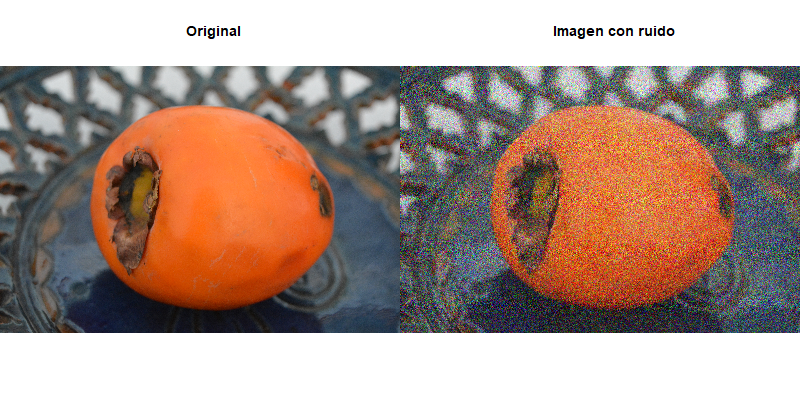
include_graphics("denoisedwt2d/gaussian_denoised.png")

```
Se observa que el uso de los diferentes filtros wavelet y reglas de aplicación del umbral no genera resultados con diferencias significativas. Sin embargo, el nivel de descomposición sí tiene un impacto notable.

Con un menor número de niveles (2-3), se logran conservar los detalles de la imagen, pero el ruido no se elimina completamente, con solo 2 niveles, el ruido sigue siendo evidente. Al aumentar a 4 niveles, se obtiene una imagen en la que el ruido es prácticamente inapreciable, aunque aparece algo más suavizada. Si se aumentaran aún más los niveles de descomposición, se empezarían a perder detalles importantes de la imagen. Con 4 niveles se consigue un buen equilibrio entre la eliminación del ruido y la conservación de los detalles. Este comportamiento se repite en los distintos tipos de ruido analizados.

A continuación mostramos solo algunas particularidades relevantes de los resultados: 

Por ejemplo, en el caso del ruido sinusoidal de alta frecuencia, el resultado del proceso de eliminación de ruido es distinto.

```{r}

# png("denoisedwt2d/sinhigh.png", width = 800, height = 400)
# 
# i_sinruido <- images[[2]]
# i_ruidosa <- add_noise_to_image("2", "sinusoidal_high", list(frequency = 25, amplitude = 0.2))
#     
# i_dim <- dim(i_sinruido)
# i_len <- length(i_sinruido)
# 
# i_denoised <- array(0, dim = dim(i_ruidosa))
# 
# par(mfrow= c(1,2))
# display(Image(i_sinruido, colormode = "Color"), method = "r")
# title("Original")
# display(Image(i_ruidosa, colormode = "Color"), method = "r")
# title("Imagen con ruido")
# 
# dev.off()
# png("denoisedwt2d/sinhigh_denoised.png", width = 1200, height = 1800)
# 
# par(mfcol= c(6,4))
# for (f in filtro){
#   for (n in nivel){
#     for (u in umbral){
#       canal1 <- denoise.dwt.2d(i_ruidosa[,,1], wf = f, rule = u, J = n)
#       canal2 <- denoise.dwt.2d(i_ruidosa[,,2], wf = f, rule = u, J = n)
#       canal3 <- denoise.dwt.2d(i_ruidosa[,,3], wf = f, rule = u, J = n)
#       i_denoised <- array(c(canal1, canal2, canal3), dim = c(nrow(canal1), ncol(canal1), 3))
#         
#       display(Image(i_denoised, colormode = "Color"), method = "r")
#       title(paste0("Wavelet ", f, ", umbral " , u, ", nivel ", n))
#   }}}
# 
# dev.off()

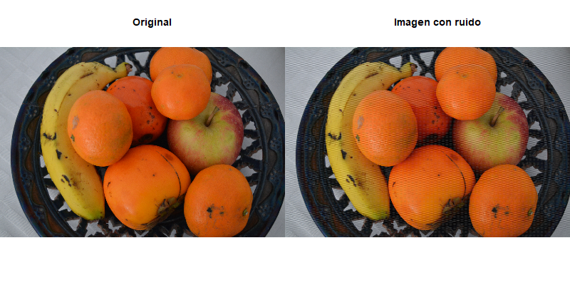
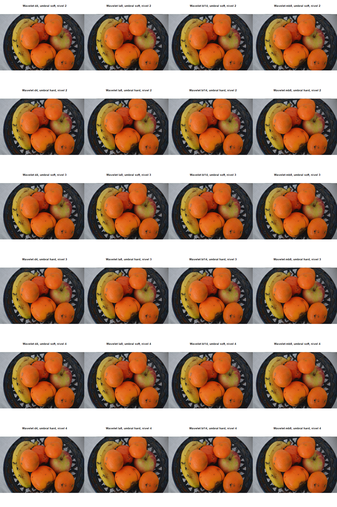

```
En este caso, vemos que en ninguno de los casos logramos eliminar completamente el ruido sinusoidal. Esto puede deberse a que este tipo de ruido presenta componentes muy específicas de alta frecuencia, que pueden coincidir con las frecuencias de los detalles importantes de la imagen, lo que dificulta eliminar el ruido sin comprometer los detalles de la imagen. 


```{r}
# png("denoisedwt2d/sinlow.png", width = 800, height = 400)
# 
# i_sinruido <- images[[3]]
# i_ruidosa <- add_noise_to_image("3", "sinusoidal_low", list(frequency = 5, amplitude = 0.2))
# 
# i_dim <- dim(i_sinruido)
# i_len <- length(i_sinruido)
# 
# i_denoised <- array(0, dim = dim(i_ruidosa))
# 
# par(mfrow= c(1,2))
# display(Image(i_sinruido, colormode = "Color"), method = "r")
# title("Original")
# display(Image(i_ruidosa, colormode = "Color"), method = "r")
# title("Imagen con ruido")
# 
# dev.off()
# png("denoisedwt2d/sinlow_denoised.png", width = 1200, height = 1800)
# 
# par(mfcol= c(6,4))
# for (f in filtro){
#   for (n in nivel){
#     for (u in umbral){
#       canal1 <- denoise.dwt.2d(i_ruidosa[,,1], wf = f, rule = u, J = n)
#       canal2 <- denoise.dwt.2d(i_ruidosa[,,2], wf = f, rule = u, J = n)
#       canal3 <- denoise.dwt.2d(i_ruidosa[,,3], wf = f, rule = u, J = n)
#       i_denoised <- array(c(canal1, canal2, canal3), dim = c(nrow(canal1), ncol(canal1), 3))
# 
#       display(Image(i_denoised, colormode = "Color"), method = "r")
#       title(paste0("Wavelet ", f, ", umbral " , u, ", nivel ", n))
#   }}}
# 
# dev.off()

# 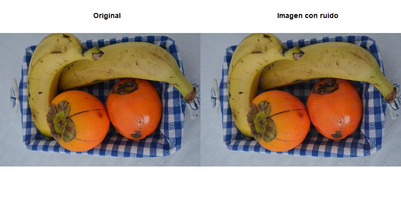
# 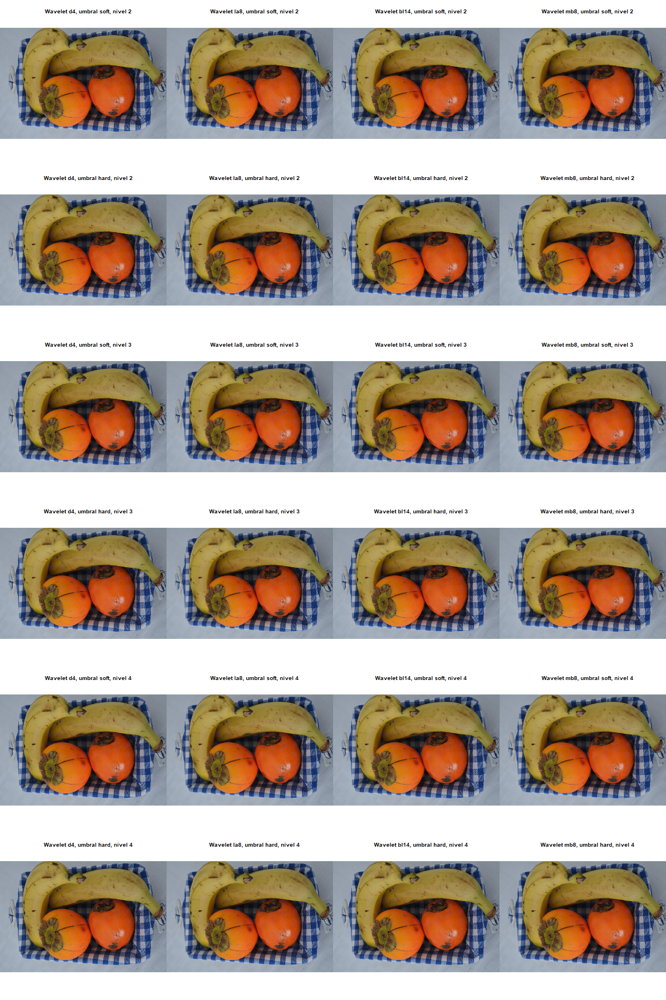

```

Otro ruido que tiene resultados peculiares es el ruido de tipo salt-and-pepper.

```{r}

# png("denoisedwt2d/pepper.png", width = 800, height = 400)
# 
# i_sinruido <- images[[4]]
# i_ruidosa <- add_noise_to_image("4", "salt_pepper", list(epsilon = 0.1))
#     
# i_dim <- dim(i_sinruido)
# i_len <- length(i_sinruido)
# 
# i_denoised <- array(0, dim = dim(i_ruidosa))
# 
# par(mfrow= c(1,2))
# display(Image(i_sinruido, colormode = "Color"), method = "r")
# title("Original")
# display(Image(i_ruidosa, colormode = "Color"), method = "r")
# title("Imagen con ruido")
# 
# dev.off()
# png("denoisedwt2d/pepper_denoised.png", width = 1200, height = 1800)
# 
# par(mfcol= c(6,4))
# for (f in filtro){
#   for (n in nivel){
#     for (u in umbral){
#       canal1 <- denoise.dwt.2d(i_ruidosa[,,1], wf = f, rule = u, J = n)
#       canal2 <- denoise.dwt.2d(i_ruidosa[,,2], wf = f, rule = u, J = n)
#       canal3 <- denoise.dwt.2d(i_ruidosa[,,3], wf = f, rule = u, J = n)
#       i_denoised <- array(c(canal1, canal2, canal3), dim = c(nrow(canal1), ncol(canal1), 3))
#         
#       display(Image(i_denoised, colormode = "Color"), method = "r")
#       title(paste0("Wavelet ", f, ", umbral " , u, ", nivel ", n))
#   }}}
# 
# dev.off()

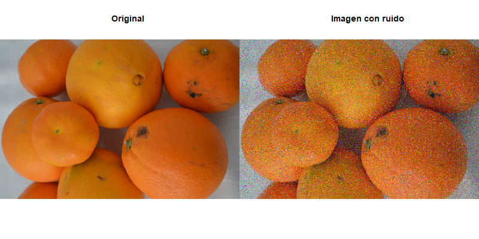
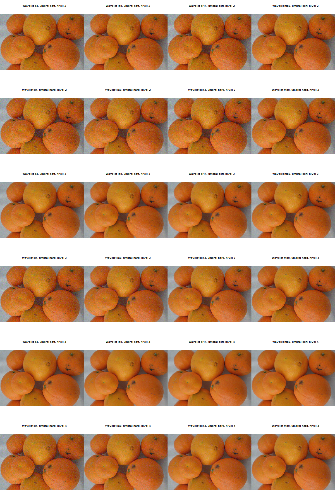

```
En este caso, de nuevo las diferencias más notables de deben a los distintos niveles de descomposición, sin embargo, también observamos diferencias sutiles en los resultados en cuanto a:

* La regla de aplicación del umbral: Al utilizar la regla soft, se consigue una mejor eliminación del ruido. Esto podría deberse a que el ruido salt and pepper asigna valores cercanos a 0 (pimienta, negro) y cercanos a 1 (sal, blanco) a algunos píxeles. Al aplicar el método hard, no se atenúan adecuadamente los picos de ruido debido a su naturaleza más agresiva.

* El filtro wavelet empleado: El rendimiento con el filtro d4 es inferior al de otros filtros. Esto se debe a que el filtro d4 es un filtro corto (con solo 4 coeficientes) y tiene una resolución de frecuencia limitada. Como resultado, no puede capturar eficazmente los picos abruptos del ruido, como los valores 0 y 1 del ruido salt and pepper.

```{r}
# png("denoisedwt2d/gamma.png", width = 800, height = 400)
# 
# i_sinruido <- images[[1]]
# i_ruidosa <- add_noise_to_image("1", "gamma", list(looks = 2))
# 
# i_dim <- dim(i_sinruido)
# i_len <- length(i_sinruido)
# 
# i_denoised <- array(0, dim = dim(i_ruidosa))
# 
# par(mfrow= c(1,2))
# display(Image(i_sinruido, colormode = "Color"), method = "r")
# title("Original")
# display(Image(i_ruidosa, colormode = "Color"), method = "r")
# title("Imagen con ruido")
# 
# dev.off()
# png("denoisedwt2d/gamma_denoised.png", width = 1200, height = 1800)
# 
# par(mfcol= c(6,4))
# for (f in filtro){
#   for (n in nivel){
#     for (u in umbral){
#       canal1 <- denoise.dwt.2d(i_ruidosa[,,1], wf = f, rule = u, J = n)
#       canal2 <- denoise.dwt.2d(i_ruidosa[,,2], wf = f, rule = u, J = n)
#       canal3 <- denoise.dwt.2d(i_ruidosa[,,3], wf = f, rule = u, J = n)
#       i_denoised <- array(c(canal1, canal2, canal3), dim = c(nrow(canal1), ncol(canal1), 3))
# 
#       display(Image(i_denoised, colormode = "Color"), method = "r")
#       title(paste0("Wavelet ", f, ", umbral " , u, ", nivel ", n))
#   }}}
# 
# dev.off()
# 
# 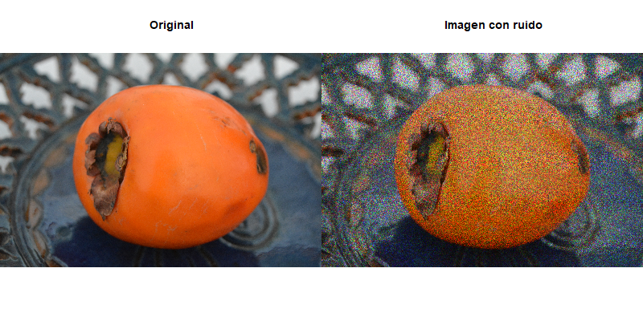
# 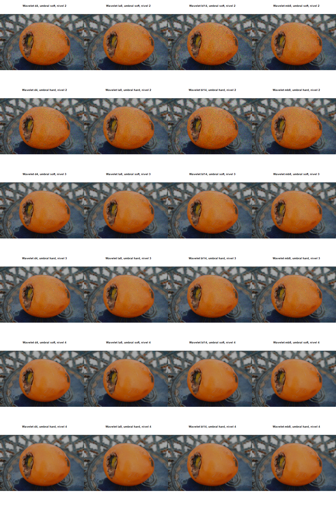

```

```{r}
# png("denoisedwt2d/multiplicative.png", width = 800, height = 400)
# 
# i_sinruido <- images[[2]]
# i_ruidosa <- add_noise_to_image("2", "uniform_multiplicative", list(looks = 2))
# 
# i_dim <- dim(i_sinruido)
# i_len <- length(i_sinruido)
# 
# i_denoised <- array(0, dim = dim(i_ruidosa))
# 
# par(mfrow= c(1,2))
# display(Image(i_sinruido, colormode = "Color"), method = "r")
# title("Original")
# display(Image(i_ruidosa, colormode = "Color"), method = "r")
# title("Imagen con ruido")
# 
# dev.off()
# png("denoisedwt2d/multiplicative_denoised.png", width = 1200, height = 1800)
# 
# par(mfcol= c(6,4))
# for (f in filtro){
#   for (n in nivel){
#     for (u in umbral){
#       canal1 <- denoise.dwt.2d(i_ruidosa[,,1], wf = f, rule = u, J = n)
#       canal2 <- denoise.dwt.2d(i_ruidosa[,,2], wf = f, rule = u, J = n)
#       canal3 <- denoise.dwt.2d(i_ruidosa[,,3], wf = f, rule = u, J = n)
#       i_denoised <- array(c(canal1, canal2, canal3), dim = c(nrow(canal1), ncol(canal1), 3))
# 
#       display(Image(i_denoised, colormode = "Color"), method = "r")
#       title(paste0("Wavelet ", f, ", umbral " , u, ", nivel ", n))
#   }}}
# 
# dev.off()
# 
# 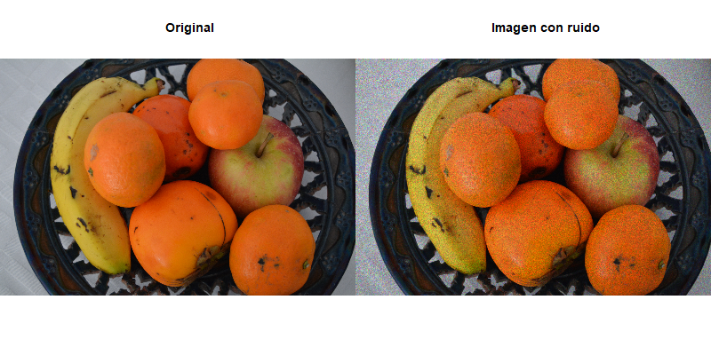
# 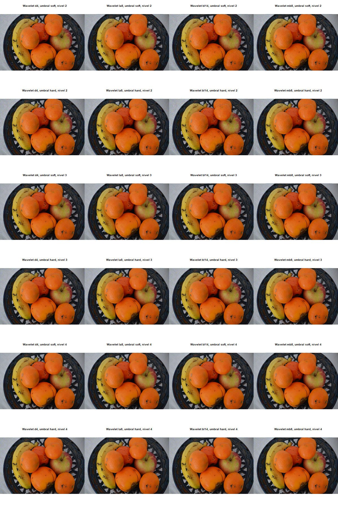

```

Por último, presentamos los resultados del proceso de denoising de la imagen 5, a la que se le ha aplicado ruido gaussiano. A diferencia de la imagen 1, en este caso la resolución de la imagen es considerablemente inferior, lo que parece influir en los resultados obtenidos.

```{r}

# png("denoisedwt2d/image5_noise.png", width = 800, height = 400)
# 
# i_sinruido <- images[[5]]
# i_ruidosa <- add_noise_to_image("5", "gaussian", list(std_dev = 0.3))
#     
# i_dim <- dim(i_sinruido)
# i_len <- length(i_sinruido)
# 
# i_denoised <- array(0, dim = dim(i_ruidosa))
# 
# par(mfrow= c(1,2))
# display(Image(i_sinruido, colormode = "Color"), method = "r")
# title("Original")
# display(Image(i_ruidosa, colormode = "Color"), method = "r")
# title("Imagen con ruido")
# 
# dev.off()
# png("denoisedwt2d/image5_denoised.png", width = 1200, height = 1800)
# 
# par(mfcol= c(6,4))
# for (f in filtro){
#   for (n in nivel){
#     for (u in umbral){
#       canal1 <- denoise.dwt.2d(i_ruidosa[,,1], wf = f, rule = u, J = n)
#       canal2 <- denoise.dwt.2d(i_ruidosa[,,2], wf = f, rule = u, J = n)
#       canal3 <- denoise.dwt.2d(i_ruidosa[,,3], wf = f, rule = u, J = n)
#       i_denoised <- array(c(canal1, canal2, canal3), dim = c(nrow(canal1), ncol(canal1), 3))
#         
#       display(Image(i_denoised, colormode = "Color"), method = "r")
#       title(paste0("Wavelet ", f, ", umbral " , u, ", nivel ", n))
#   }}}
# 
# dev.off()

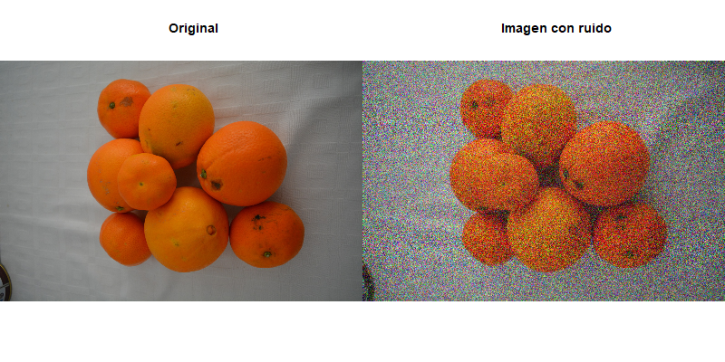
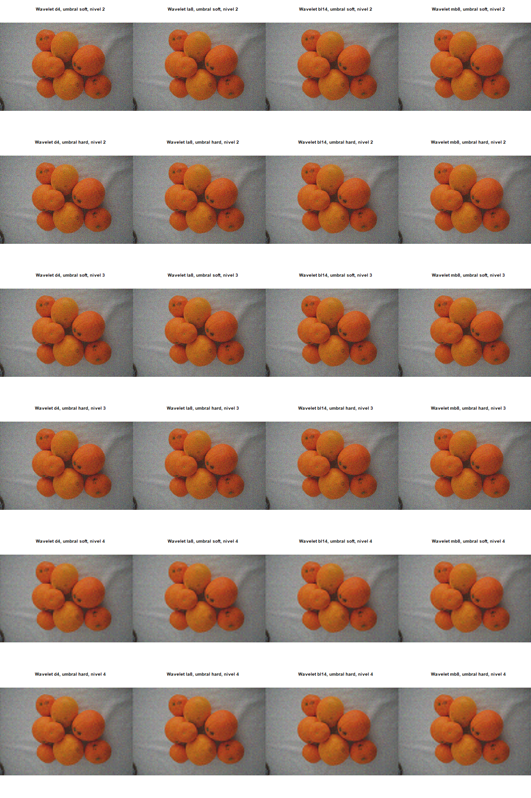

```

La diferencia más notable en comparación con el resto de resultados, es que en este caso, al aumentar el numero de niveles de descomposición a un número que nos permita eliminar la mayor parte del ruido, la calidad de la imagen se ve significativamente afectada, y obtenemos una imagen excesivamente suavizada. Esto puede deberse a que a medida que aumentan los niveles de descomposición, la imagen se descompone en frecuencias cada vez más altas, provocando la pérdida de detalles finos.

La baja resolución de la imagen hace que sea más difícil mantener un equilibrio entre la eliminación del ruido y la preservación de los detalles. Al aumentar los niveles de descomposición, el ruido se elimina en mayor medida, pero también se pierde mucha información útil.
>>>>>>> Rebeca

# Conclusiones
