```{r,include=FALSE}
rm(list = ls())
knitr::opts_chunk$set(echo=FALSE,fig.align='center',out.width = '100%', eval = FALSE)
# Con echo = FALSE evitamos que los chunks de código se muestren en el pdf
# Con eval = FALSE evitamos que se ejecuten. Por cuestiones de velocidad al generar el pdf no se ejecuta todo el codigo, sino que previamente se ejecutado todo y guardado las imágenes resultantes, que son las que se muestran en el pdf. 
# Los chunks que si sean necesario ejectutarse cada vez incluirán eval = TRUE.
```

# Introducción  

En el campo del análisis de señales, un problema importante es la eliminación de ruido en imágenes digitales. Las señales a menudo están contaminadas por ruido debido a interferencias en los procesos de captura o transmisión. Este ruido, que puede existir de formas muy diversas como ruido gaussiano, artefactos asociados a frecuencias altas o bajas, o efectos multiplicativos, complica la extracción de características significativas.

El uso de wavelets es una herramienta clave para abordar este problema. Este método ofrece la posibilidad de adaptarse a las características particulares de cada tipo de ruido para su eliminación.

En este trabajo se explorarán la capacidad de los wavelets para la eliminación de ruido en imágenes. Para ello, se generarán diferentes tipos de ruido sintético y se determinarán los parámetros más eficaces de las wavelets para su eliminación a través de 3 métodos distintos.  

# Fundamento teórico: eliminación de ruido con wavelets

Los wavelets son funciones matemáticas que suelen emplear para descomponer una señal en componentes de diferentes escalas, lo que resulta útil para identificar y procesar características específicas. Este enfoque es especialmente relevante en la eliminación de ruido, donde las frecuencias indeseadas pueden ser separadas y reducidas sin afectar significativamente las características principales de la señal original. A diferencia de la transformada de Fourier, que opera globalmente y no ofrece información sobre el espacio, los wavelets permiten un análisis localizado, facilitando la identificación de patrones y anomalías en los datos.

El proceso de reducción de ruido con wavelets generalmente incluye tres etapas principales: la descomposición de la señal utilizando una wavelet madre, la modificación de los coeficientes wavelet mediante técnicas de umbral, y la reconstrucción de la señal. La selección de la wavelet madre adecuada y los parámetros de umbral son aspectos críticos que deben adaptarse a las características específicas del ruido y la señal.

Los wavelets resultan especialmente útiles en aplicaciones donde la reconstruccion fiel de la imagen si ruido es esencial, como en imágenes médicas, procesamiento de audio o análisis de datos científicos.

# Funciones de programacion empleadas 

```{r, eval = TRUE}
rm(list = ls())
```


```{r, message = FALSE, eval = TRUE}
# Antes de comenzar, instalamos y/o cargamos todos los paquetes requeridos.
if (!require("pacman")) install.packages("pacman")
library(pacman)
p_load(imager, wavethresh, ggplot2, dplyr, SpatialPack, waveslim, EBImage, stringr, jpeg, abind, magick, knitr)
```

Se ha escogido emplear tres métodologías distintas para realizar la eliminación de ruido. Dos de ellas se basan en emplear la transformada wavelet. Sin embargo, también se ha optado por emplear en un tercer método el análisis mediante transformadas de Fourier con el objetivo de encontrar similitudes y diferencias con respecto a los métodos que emplean wavelets.

Con respecto a los métodos con wavelets utilizaremos un método muy directo, empleando la función `denoise.dwt.2d` del paquete `waveslim` de R. Por otro lado,
emplearemos un método más manual que consiste en realizar la transformada wavelet discreta con la función `imwd`, aplicar una función para realizar el thresholding y a continuación realizar la transformada inversa. 

Para finalizar, se realizará la eliminación de ruido a través de transformadas de Fourier con la función `fft` y compararemos los resultados obtenidos con cada método.

**Método 1. Eliminación de ruido con el algoritmo de Mallat**

Empleamos la funicón `imwd()` del paquete wavethresh. Está función realiza una
transformada discreta wavelet de acuerdo con el algoritmo de Mallat.

- `imwd(image, filter.number=10, family="DaubLeAsymm", type="wavelet",...).`

El argumento `image` de la función debe ser una matriz cuadrada cuya dimensión
sea potencia de dos. `filter.number` elige la suavidad de la wavelet a emplear, siendo por defecto 10. `family` indica la familia de wavelets a emplear ("DaubExPhase" ó "DaubLeAsymm"). Para tratar las fronteras, mantendremos el parámetro `bc = "periodic"` por defecto.

```{r, eval = TRUE, fig.width=5, fig.height=3}
# Representación de las dos familias de wavelets empleadas por la función imwd.

# Generación de un filtro con los coeficientes correspondientes de cada wavelet
wave_coeffs <- filter.select(filter.number = 10, family = "DaubLeAsymm")
wave_coeffs_2 <- filter.select(filter.number = 10, family = "DaubExPhase")

# Eje temporal
x <- seq_along(wave_coeffs$H)

# # Visualización de las wavelets
par(mfrow = c(1, 2))

plot(x, wave_coeffs$H, type = "l", lwd = 2,
     main = "Wavelet DaubLeAsymm",
     xlab = "x", ylab = "Amplitud")
points(x, wave_coeffs$H, pch = 19)

plot(x, wave_coeffs_2$H, type = "l", lwd = 2,
     main = "Wavelet DaubExPhase",
     xlab = "x", ylab = "Amplitud")
points(x, wave_coeffs_2$H, pch = 19)


rm(wave_coeffs)
rm(wave_coeffs_2)
rm(x)

```

Para la eliminación de ruido aplicaremos la función `threshold()` al objeto que
devuelve la función `imwd()`. 

- `threshold(imwd, levels = 3:(nlevelsWT(imwd) - 1), type = "hard", policy = "universal", by.level = FALSE, value = 0, return.threshold = FALSE, compression = TRUE, Q = 0.05, ...)`

`levels` es el número de niveles a los cuáles deseamos aplicar un umbral, mientras que `type` indica si queremos un umbral más suave ("soft") ó más fuerte ("hard"). El parámetro `policy` selecciona la técnica para elegir umbral. `by.level = FALSE` significa que se aplica un umbral global a todos los niveles indicados, mientras que `by.level = TRUE` calcular threshold para cada nivel por seaparado. El parámetro `value`, el valor del umbral, se usará si elegimos técnicas manuales en `policy`. Si queremos obtener el valor umbral aplicado, pondremos `return.threshold = TRUE`. Finalmente, dejaremos el parámetro `compression = TRUE` por defecto, para obtener un objeto más pequeño. 

Durante el desarrollo del trabajo variaremos estos parámetros para observar su efecto en la eliminación de diversos tipos de ruido y encontar aquellos que generen un mejor resultado en cada caso. Una vez realizado el thresholding, emplearemos la función `imwr` para realizar la transformda wavelet inversa y poder visualizar la imagen tras la eliminación de ruido.

**Método 2. Función denoise.dwt.2d**

Empleamos la función `denoise.dwt.2d()` del paquete waveslim, que emplea la transformada wavelet discreta en las dos direcciones de la imagen (DWT-2D).

- `denoise.dwt.2d(x, wf = "la8", J = 4, method = "universal", H = 0.5, noise.dir = 3, rule = "hard")`

`wf` es el filtro wavelet a emplear, pudiendo tomar diversos valores predeterminados que indican la forma de la wavelet y el número de coeficientes. `J` es el número de niveles de la descomposición, la profundidad de la misma. `method` es la técnica empleada para elegir umbral. `H` es el parámetro de Hurst, una medida de autocorrelación a largo plazo de los datos. `noise.dir`define el número de direcciones espaciales en las que se calcula la estimación del ruido. Finalmente `rule` indica la regla a emplear para la aplicación del umbral.

Esta función descompone la imagen en coeficientes wavelet, aplicando un filtro wavelet seleccionado (`wf`). Como resultado, la imagen queda dividida en 4 subimágenes o subbandas:

* Aproximación (LL): Componentes de baja frecuencia tanto en las filas como en las columnas. Es la versión suavizada o "borrosa" de la imagen, que captura las características generales.

* Horizontal (LH): Componentes de baja frecuencia en las filas y alta frecuencia en las columnas. Contiene detalles horizontales de la imagen.

* Vertical (HL): Componentes de alta frecuencia en las filas y baja frecuencia en las columnas. Representa los detalles verticales.

* Diagonal (HH): Contiene las componentes de alta frecuencia tanto en las filas como en las columnas.

Esta descomposición en 4 cuadrantes se repite tantas veces como niveles (`J`) se especifiquen en la función.

El siguiente paso es calcular y aplicar el umbral para ajustar o eliminar los coeficientes de más alta frecuencia en las subbandas de detalle HL, LH y HH en cada nivel de descomposición. Cabe destacar que no se aplica el umbral a la subimagen LL, ya que contiene las componentes de baja frecuencia, que -generalmente- no están afectadas por el ruido.

Después de aplicar el umbral para suprimir el ruido, la imagen se reconstruye empleando la transformada wavelet inversa (IDWT). Como se observa, esta función es una aplicación más directa del método anterior, ya implementada en una única función. 

Al igual que con el método anterior, emplearemos esta función variando diferentes parámetros e interpretando los resultados. 
  
**Método 3. Transformada de Fourier (función fftshift)**


El método usado usa la transformada rápida de fourier para poder eliminar altas frecuencias correspondientes a ruido en la imagen. La función `fftshift` desplaza las bajas frecuencias al centro del espectro y las altas a los extremos para realizar aplicar `fft`. Una vez se visualiza el espectro, se procede a disminuir la magnitud de las altas frecuencias cercanas a los extremos asignandoles una magnitud menor.A continuación, se reconstruye la imagen deshaciendo el desplazamiento y realizando la transformada inversa.

Además de las funciones ya implementadas en R a lo largo del trabajo se programaran diversas funciones que ayudarán a automatizar el proceso.

# Desarrollo y resultados


Comenzamos cargando y visualizando las fotografías a emplear.
```{r, eval = TRUE}
images_path <- list.files("./fotos", full.names = TRUE)

nombres_images <- str_remove_all(string = str_remove_all(string = images_path, pattern = "./fotos/"), pattern = "\\.JPG|\\.jpg")

images <- lapply(images_path, readJPEG) # Cargamos las imágenes
names(images) <- nombres_images

rm(images_path)
```

```{r, eval = TRUE}
# Rotamos algunas de las fotos para una visualización más uniforme
fotos_a_girar <- c("1", "2", "3", "4")
images_rotadas <- lapply(images[fotos_a_girar], aperm, perm = c(2, 1, 3))


for (i in fotos_a_girar) {
  images_rotadas[[i]] < images_rotadas[[i]][dim(images_rotadas[[i]])[1]:1, , ]
}

images[fotos_a_girar] <- images_rotadas
rm(images_rotadas)
rm(fotos_a_girar)
```

Vamos a visualizar las imágenes empleadas. Se han tomado 5 imágenes distintas pero todas con la misma temática. La elección se ha realizado pensando en poder observar como afecta la elimación de ruido en detalles como la textura o defectos en las frutas. Además, las imágenes 1 a 4 se han tomado con una cámara de gran calidad, mientras que la imagen 5 cuenta con una resolución mucho menor. Se busca también estudiar que efecto tiene la resolución de la imagen en la eliminación de ruido.
```{r}
# Visualizamos las imagenes originales 
png("fotos/all_images.png", width = 700, height = 350)
par(mfrow = c(2, 3), mar = c(1, 1, 1, 1))

 for (img in nombres_images) {
   EBImage::display(Image(images[[img]], colormode = "Color"), method = "r")
   title(paste('Imagen', img))
 }
dev.off()
```
```{r, eval = TRUE, out.width="75%"}
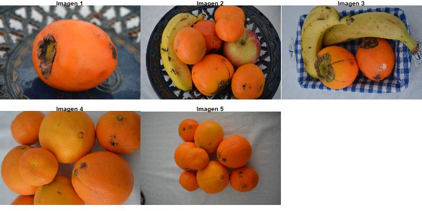
```


## Inclusión de ruido sintético en las imágenes  
Se crean la función `add_noise_to_image` y `NOISE_TYPES` para añadir el ruido a las imágenes. Los ruidos que se han generado, con parámetros ajustables a variar, son los siguientes:

- Ruido gaussiano de media 0 y desviación típica ajustable.
- Ruidos sinusoidales de alta y baja frecuencia.
- Ruido sal y pimienta: Este tipo de ruido sustituye píxeles aleatorios en la imagen por valores mínimos (negros) o máximos (blancos), simulando un patrón de puntos oscuros y brillantes
- Ruido gamma multiplicativo: multiplica el valor de los píxeles por una distribución gamma.
- Ruido uniforme multiplicativo: multiplica el valor de los píxeles por una distribución uniforme.

Estos ruidos sintéticos pueden imitar ruidos que se encuentren en imágenes reales. Por ejemplo, el ruido sinusoidal introduce un patrón periódico de oscilaciones que pueden simular interferencias periódicas. Otro ejemplo es el ruido sal y pimienta, que puede simular fallos en la captura de las imágenes (la aparición de puntos blancos y negros).

```{r, fig.height = 4, eval = TRUE}
# Definición de tipos de ruido

NOISE_TYPES <- list(
  gaussian = list(
    generator = function(channel, params) {
      # Desviación estándar del ruido con un valor predeterminado
      noise_std_dev <- params$std_dev %||% 0.5

      # Generación de ruido gaussiano
      noise <- array(
        rnorm(length(channel), mean = 0, sd = noise_std_dev),
        dim = dim(channel)
      )

      # Asegurar que los valores estén entre 0 y 1
      pmax(0, pmin(1, channel + noise))
    }
  ),
  sinusoidal_high = list(
    generator = function(channel, params) {
      # Frecuencia y amplitud del ruido sinusoidal de alta frecuencia
      frequency <- params$frequency %||% 25
      amplitude <- params$amplitude %||% 0.2

      # Generación de ruido sinusoidal
      height <- dim(channel)[1]
      width <- dim(channel)[2]
      x <- seq(0, 2 * pi, length.out = width)
      y <- seq(0, 2 * pi, length.out = height)
      noise_grid <- outer(sin(x * frequency), sin(y * frequency))

      # Aplicar el ruido
      noise <- array(noise_grid * amplitude, dim = dim(channel))
      pmax(0, pmin(1, channel + noise))
    }
  ),
  sinusoidal_low = list(
    generator = function(channel, params) {
      # Frecuencia y amplitud del ruido sinusoidal de baja frecuencia
      frequency <- params$frequency %||% 2
      amplitude <- params$amplitude %||% 0.2

      # Generación de ruido sinusoidal
      height <- dim(channel)[1]
      width <- dim(channel)[2]
      x <- seq(0, 2 * pi, length.out = width)
      y <- seq(0, 2 * pi, length.out = height)
      noise_grid <- outer(sin(x * frequency), sin(y * frequency))

      # Aplicar el ruido
      noise <- array(noise_grid * amplitude, dim = dim(channel))
      pmax(0, pmin(1, channel + noise))
    }
  ),
  salt_pepper = list(
    generator = function(channel, params) {
      # Proporción de píxeles afectados por el ruido de sal y pimienta
      epsilon <- params$epsilon %||% 0.2

      # Generación de ruido
      noise <- matrix(sample(c(0, 1, NA), length(channel), replace = TRUE, prob = c(epsilon / 2, epsilon / 2, 1 - epsilon)),
        nrow = dim(channel)[1], ncol = dim(channel)[2]
      )
      channel[!is.na(noise)] <- noise[!is.na(noise)]
      channel
    }
  ),
  gamma = list(
    generator = function(channel, params) {
      # Ruido multiplicativo gamma con parámetro de dispersión
      looks <- params$looks %||% 2
      noise <- array(rgamma(length(channel), shape = looks, scale = 1 / looks), dim = dim(channel))
      pmax(0, pmin(1, channel * noise))
    }
  ),
  uniform_multiplicative = list(
    generator = function(channel, params) {
      # Ruido multiplicativo uniforme
      looks <- params$looks %||% 2
      noise_channel <- SpatialPack::imnoise(
        img = channel,
        type = "speckle",
        looks = looks
      )
      pmax(0, pmin(1, noise_channel))
    }
  )
)
```


```{r, fig.height = 4, eval = TRUE}
# Función para añadir ruido a una imagen
add_noise_to_image <- function(image_name, noise_type, noise_params = list(), plot = FALSE) {
  # Verificar si la imagen existe en la lista
  if (!image_name %in% names(images)) {
    stop("La imagen con este nombre no se encuentra en la lista 'images'")
  }

  # Verificar el tipo de ruido
  if (!noise_type %in% names(NOISE_TYPES)) {
    stop(
      "El tipo de ruido es desconocido. Tipos disponibles: ",
      paste(names(NOISE_TYPES), collapse = ", ")
    )
  }

  # Obtener la imagen original de la lista
  original_image <- images[[image_name]]

  # Convertir la imagen a un array si es necesario
  image_array <- as.array(original_image)

  # Aplicar ruido a cada canal
  noisy_channels <- lapply(1:3, function(i) {
    channel <- image_array[, , i]
    NOISE_TYPES[[noise_type]]$generator(channel, noise_params)
  })

  # Crear la imagen con ruido
  noisy_image_array <- array(
    unlist(noisy_channels),
    dim = dim(image_array)
  )


  # Visualizar si se ha indicado
  if (plot == TRUE){
  layout(matrix(1:2, 1, 2))
  plot(Image(original_image, colormode = "Color"))
  title("Original")
  plot(Image((noisy_image_array), colormode = "Color"))
  title(paste("Ruido:", noise_type))}
  
  return(noisy_image_array)
}

```


## Función imwd

Uno de los parametros de la funcion `threshold` explicada anteriormente es policy, el cual determina el valor del umbral utilizado en el proceso de eliminación de ruido. Se exploran tres enfoques diferentes para la selección del umbral: universal, fdr y manual.

**Umbral Universal**

El umbral "universal", fue propuesto por Donoho y Johnstone(1995). Esta estrategia calcula el umbral aplicado a los coeficientes de wavelet en función del tamaño de la señal y una estimación del nivel de ruido. Este enfoque tiene como objetivo establecer un umbral de manera que se eliminen los coeficientes de wavelet que corresponden al ruido, mientras se conservan aquellos que contienen la señal significativa.
La fórmula del umbral "universal" es $$ \sigma \sqrt{2 \log nd}$$ donde $\sigma$ es una estimación del ruido y *nd* es el número de coeficientes en la subbanda de detalles correspondiente a un nivel de la transformada wavelet. Este valor se obtiene accediendo a los coeficientes de la subbanda D de cada nivel.

**Umbral FDR**

La tasa de falsos positivos (FDR) es una técnica estadística utilizada para controlar la tasa de falsos positivos en el proceso de selección de coeficientes relevantes, tal como se describe en el trabajo de Abramovich y Benjamini (1996). En el contexto de la reducción de ruido mediante la Transformada Wavelet, el objetivo principal de FDR es identificar y eliminar los coeficientes asociados al ruido, mientras se preservan aquellos que contienen información significativa, como bordes, texturas o detalles importantes de la imagen. Esto se logra calculando, para cada coeficiente de la transformada, la probabilidad de que dicho coeficiente sea un falso positivo, es decir, que corresponda a ruido pero sea erróneamente considerado relevante.

**Umbral Manual**

Se fija un umbral manualmente.

### Redimensionando las imágenes

Para aplicar el algoritmo de Mallat (IMWD), es necesario que la imagen tenga una forma cuadrada cuyas dimensiones sean potencia de dos. Dado que muchas imágenes no son cuadradas, es necesario convertirlas antes de aplicar el algoritmo, por lo que debemos realizar un pre-procesamiento de las imágenes. Se han escogido 2 maneras distintas para obtener imágenes con el tamaño adecuado. Por un lado, redimensionaremos las imágenes con la función `resize`, lo que podría conllevar problemas de distorsión si las imágenes estaban lejos de tener dimensiones cuadradas. Por ello, también vamos a emplear otra técnica y rellenaremos las matrices de las imágenes con valores de 0 ó 1 hasta alcanzar las dimensiones adecuadas.

Como ya se ha visto para poder aplicar la función `imwd()`es necesario partir de una matriz cuadrada cuyas dimensiones sean potencia de dos. Por ello, en primer lugar creamos una función `resize_imwd()` tal que dada una foto busca la submatriz cuadrada y potencia de dos más grande posible y a continuacón redimensiona la imagen a dicha submatriz cuadrada.

```{r,echo=FALSE}
# Pre-procesamiento al aplicado de función imwd. Redimensionamiento de la imagen 

resize_imwd<- function(foto){
  
  img <- as.cimg(foto) # Pasar a formato Imager para aplicar función resize
   
  dim_foto <- dim(foto) # Dimensiones de la foto
  filas <- dim_foto[1]
  columnas <- dim_foto[2]
  
  lado_minimo <- min(filas, columnas)  # Tamaño submatriz cuadrada mas grande
  lado_potencia2 <- 2^floor(log2(lado_minimo)) # Tamaño submatriz potencia de dos mas grande
  
  foto_resized <-resize(foto, w = lado_potencia2, h = lado_potencia2) 

return(foto_resized)
}
```

Por otro lado, también creamos una función para el post-procesamiento de las imágenes tras la eliminación de ruido. Queremos devolverlas a su tamaño original con el objetivo de comparar con las imágenes iniciales.

```{r}
# Post-procesamiento de la imagen: Redimensionamiento a su tamaño original.

resize_imwd_to_original<- function(image_redimensionada, nombre_foto){
  
  #img <- as.cimg(image_redimensionada)
  foto <- images[[nombre_foto]]
  
  # Dimensiones de la foto
  dim_foto <- dim(foto)
  filas <- dim_foto[2]
  columnas <- dim_foto[1]
  
  # Redimensionado de la imagen
  foto_resized <-EBImage::resize(image_redimensionada, w = columnas, h = filas) 
 

return(foto_resized)
}
```

Comenzamos generando una función `procesar_imagen_wavelet` con parámetros foto, tipo y policy. Esta función realiza en primer lugar la transformada wavelet a cada uno de los tres canales de una imagen. A continuación, se realiza el thresholding con la función threshold, pudiendo variar de el tipo de "hard" a "soft" y el parámetro policy (modificando adecuadamente los parámetros necesarios en la función threshold en este último caso). Una vez realizada la eliminación de ruido, se aplica la trasnformada wavelet inversa `imwr` para por último reconstruir la imagen a partir de los tres canales.

```{r, echo = TRUE, eval = TRUE}
procesar_imagen_wavelet <- function(foto, tipo = "hard", policy = "universal") {
  # 1. Realizamos la transformada wavelet a cada canal
  lwd <- lapply(1:3, function(canal) {
    imwd(foto[,,canal])  
  })
  
  # 2. Aplicamos el umbral a los coeficientes de la transformada wavelet
  lwd_threshold <- lapply(lwd, function(canal_wd) {
    niveles <- canal_wd$nlevels
    wavethresh::threshold(canal_wd, levels = 3:(niveles-1), type = tipo,
                          policy = policy,by_level=TRUE,compression=FALSE)
  })
  # 3. Aplicamos la transformada wavelet inversa a cada canal umbralizado
  ilwd <- lapply(lwd_threshold, function(canal_umbralizado) {
    wavethresh::imwr(canal_umbralizado)  # Transformada wavelet inversa
  })
  
  # 4. Reconstruir la imagen combinando los tres canales procesados
  imagen_reconstruida <- abind::abind(ilwd[[1]], ilwd[[2]], ilwd[[3]], along = 3)
    imagen <- Image(imagen_reconstruida, colormode = 'Color')
  
  return(imagen)
}
```


Para comenzar el análisis, vamos a emplear dos imágenes muy parecidas (imágenes 4 y 5). Una de ellas tiene muy alta resolución mientras que la segunda cuenta con una calidad mucho menor. El objetivo es determinar si la resolución de la imagen afecta a la hora de eliminar ruido de esta. Vamos a probar con el primer tipo de ruido, ruido gaussiano.

```{r}
# Añadimos ruido gaussiano a las imágenes con sd = 0.3
image_4_gaussian_noise <- add_noise_to_image("4", "gaussian", list(std_dev = 0.3))
image_5_gaussian_noise <- add_noise_to_image("5", "gaussian", list(std_dev = 0.3))

# Hacemos una lista con las imágenes con ruido a redimensionar
images_for_imwd_cut_1 <- list(image_4_gaussian_noise, image_5_gaussian_noise)
names(images_for_imwd_cut_1) <- c('4 Noise: gaussian', '5 Noise: gaussian')

# Eliminamos variables innecesarias
rm(image_4_gaussian_noise)
rm(image_5_gaussian_noise)
```

Aplicamos la función `resize_imwd` creada anteriormente para obtener una matriz con las dimensiones necesarias para aplicar la transformada wavelet.
```{r, message = FALSE}
images_recortadas <- lapply(images_for_imwd_cut_1, resize_imwd)
```

Una vez tenemos las imágenes con ruido generadas y redimensionadas adecuadamente, podemos aplicar la función `imwd` a cada uno de los tres canales (R, G y B). Empleamos la función `procesar_imagen_wavelet` que devuelve las imágenes reconstruidas después del thresholding. Para ruido gaussiano y para comenzar, vamos a elegir los parámetros por defecto de la función para el thresholding.

```{r, message = FALSE}
images_sin_ruido_gaussiano <- lapply(images_recortadas, procesar_imagen_wavelet)
```
Finalmente, visualizamos los resultados. Primeramente, observamos las imágenes redimensionadas con ruido y la imagen obtenida tras el uso del método de thresholding para la eliminación de este. Observamos una principal diferencia entre ambas: la foto que contaba con menor resolución presenta también el peor resultado. Aunque el ruido haya sido eliminado, sus bordes están más difuminados y tiene muy baja calidad.

```{r}
png("imwd/image4_5_gaussian.png", width = 800, height = 400)
par(mfrow = c(2, 2), cex = 0.5)

EBImage::display(Image(images_recortadas[[1]], colormode = 'Color'), method='r')
title('Imagen 4 con ruido')
EBImage::display(Image(images_sin_ruido_gaussiano[[1]], colormode = 'Color'), method='r')
title('Imagen 4 sin ruido')

EBImage::display(Image(images_recortadas[[2]], colormode = 'Color'), method='r')
title('Imagen 5 con ruido')
EBImage::display(Image(images_sin_ruido_gaussiano[[2]], colormode = 'Color'), method='r')
title('Imagen 5 sin ruido')

dev.off()
```
```{r, eval = TRUE, out.height="25%"}
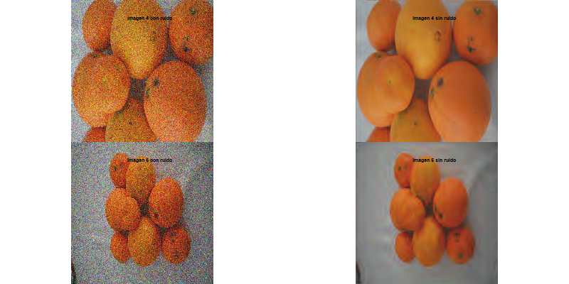
```

En segundo lugar, vamos a visualizar las imágenes originales y las imágenes sin ruido redimensionadas a su tamaño original, usando la función `resize_imwd_to_original`.

```{r}
images_sin_ruido <- Map(resize_imwd_to_original, images_sin_ruido_gaussiano, c("4", "5") )
```


```{r}
png("imwd/image4_5_original_size.png", width = 800, height = 400)
par(mfrow = c(2, 2), cex = 0.5)

EBImage::display(Image(images[[4]], colormode = 'Color'), method='r')
title('Imagen 4 original')
EBImage::display(Image(images_sin_ruido[[1]], colormode = 'Color'), method='r')
title('Imagen 4 sin ruido')

EBImage::display(Image(images[[5]], colormode = 'Color'), method='r')
title('Imagen 5 original')
EBImage::display(Image(images_sin_ruido[[2]], colormode = 'Color'), method='r')
title('Imagen 5 sin ruido')
dev.off()
```

```{r, eval = TRUE, out.height="25%"}
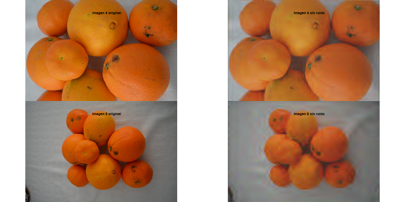
```


Vemos que efectivamente, la imagen que originalemente contaba con un número de píxeles mucho menor, la imagen 5, presenta una gran distorsión tras la eliminación de ruido.

```{r}
rm(images_for_imwd_cut_1,images_sin_ruido_gaussiano)
```


A continuación vamos a comprobar que es lo que ocurre cuando añadimos ruido sintético sinusoidal y si la frecuencia de este afecta al resultado de la eliminación de ruido. Trabajaremos con una única fotografía: la imagen 1.

```{r}
# Añadimos ruido sinusoidal a las imágenes con sd = 0.3
image_1_sinosuidal_high <- add_noise_to_image("1", "sinusoidal_high", list(frequency = 50, amplitude = 0.3))
image_1_sinosuidal_low <- add_noise_to_image("2", "sinusoidal_low", list(frequency = 5, amplitude = 0.3))

# Hacemos una lista con las imágenes con ruido a redimensionar
images_for_imwd_cut_2 <- list(image_1_sinosuidal_high , image_1_sinosuidal_low )
names(images_for_imwd_cut_2) <- c('1 Noise: sinusoidal high', '1 Noise: sinusoidal low')

# Eliminamos variables innecesarias
rm(image_1_sinosuidal_high)
rm(image_1_sinosuidal_low)
```

```{r, message = FALSE}
images_recortadas <- lapply(images_for_imwd_cut_2, resize_imwd)
images_sin_ruido_sinusoidal<- lapply(images_recortadas, procesar_imagen_wavelet)
```
Esta claro que los parámetros por defecto de la función threshold no son capaces de eliminar el ruido de tipo sinusoidal de la manera en que si lo era con el ruido de tipo gaussiano, un tipo de ruido aleatorio, al contrario que el sinusoidal, que es una señal periódica.
```{r}
png("imwd/image1_sinusoidal.png", width = 800, height = 400)
par(mfrow = c(2, 2), cex = 0.5)


EBImage::display(Image(images_recortadas[[1]], colormode = 'Color'), method='r')
title('Imagen 1 con ruido de frecuencia alta')

EBImage::display(Image(images_sin_ruido_sinusoidal[[1]], colormode = 'Color'), method='r')
title('Imagen 1 sin ruido')


EBImage::display(Image(images_recortadas[[2]], colormode = 'Color'), method='r')
title('Imagen 1 con ruido de frecuencia baja')

EBImage::display(Image(images_sin_ruido_sinusoidal[[2]], colormode = 'Color'), method='r')
title('Imagen 1 sin ruido')

dev.off()
```

```{r, eval = TRUE, out.height="25%"}
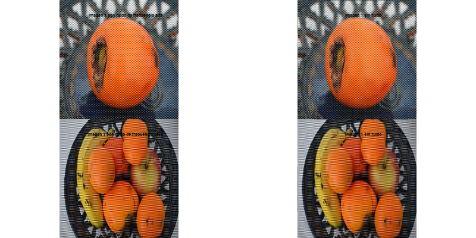
```


Vamos a variar parámetros de la función threshold para intentar quitar este ruido de manera más manual. En primer lugar, cambiamos el número de niveles al que aplicamos el umbral, para incluirlos a todos. Cambiamos policy a "manual" y variamos el valor del umbral de forma manual hasta encontrar uno que sea satisfactorio. 
```{r}
procesar_imagen_wavelet_sinusoidal <- function(foto, tipo = "hard", policy = "universal") {
  # 1. Realizamos la transformada wavelet a cada canal
  lwd <- lapply(1:3, function(canal) {
    imwd(foto[,,canal])  
  })
  
  # 2. Aplicamos el umbral a los coeficientes de la transformada wavelet
  lwd_threshold <- lapply(lwd, function(canal_wd) {
    niveles <- canal_wd$nlevels
    wavethresh::threshold(canal_wd, levels = 1:(niveles-1), type = tipo, policy = policy,by_level=TRUE,compression=FALSE, value = 4)
  })
  # 3. Aplicamos la transformada wavelet inversa a cada canal umbralizado
  ilwd <- lapply(lwd_threshold, function(canal_umbralizado) {
    wavethresh::imwr(canal_umbralizado)  # Transformada wavelet inversa
  })
  
  # 4. Reconstruir la imagen combinando los tres canales procesados
  imagen_reconstruida <- abind::abind(ilwd[[1]], ilwd[[2]], ilwd[[3]], along = 3)
    imagen <- Image(imagen_reconstruida, colormode = 'Color')
  
  return(imagen)
}
```


```{r, message = FALSE}
images_sin_ruido_sinusoidal<- lapply(images_recortadas, procesar_imagen_wavelet_sinusoidal, tipo ="soft", policy = "manual")
```

Con un valor de umbral de 4 y variando el tipo a "soft", observamos que hemos conseguido eliminar el ruido sinusoidal de alta frecuencia, pero pagando un precio muy alto: los bordes de la imagen se disorsionan completamente y tenemos una muy baja resolución. Por otro lado, el ruido de frecuencia baja, aunque ha disminuido, claramente sigue presente en la imagen.
```{r}
png("imwd/image1_sinusoidal_manual.png", width = 800, height = 400)
par(mfrow = c(2, 2), cex = 0.5)


EBImage::display(Image(images_recortadas[[1]], colormode = 'Color'), method='r')
title('Imagen 1 con ruido de frecuencia alta')

EBImage::display(Image(images_sin_ruido_sinusoidal[[1]], colormode = 'Color'), method='r')
title('Imagen 1 sin ruido')


EBImage::display(Image(images_recortadas[[2]], colormode = 'Color'), method='r')
title('Imagen 1 con ruido de frecuencia baja')

EBImage::display(Image(images_sin_ruido_sinusoidal[[2]], colormode = 'Color'), method='r')
title('Imagen 1 sin ruido')

dev.off()
```

```{r, eval = TRUE, out.height="25%"}
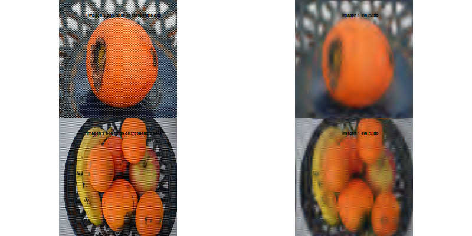
```

Probamos otros tipos de ruido: gamma, salt and pepper y ruido uniforme en las imágenes 2 y 3. 
```{r}
# Añadimos ruido a imágenes
image_2_salt_pepper <- add_noise_to_image("2", "salt_pepper", list(epsilon = 0.1))
image_3_gamma <- add_noise_to_image("3", "gamma", list(looks = 2))
image_3_uniform <- add_noise_to_image("3", "uniform_multiplicative", list(looks = 2))


# Hacemos una lista con las imágenes con ruido a recortar
images_for_imwd_cut_3 <- list( image_2_salt_pepper, image_3_gamma, image_3_uniform)
names(images_for_imwd_cut_3) <- c('2 Noise: salt and pepper', '3 Noise: gamma','3 Noise: uniform')

# Eliminamos variables innecesarias
rm(image_2_salt_pepper, image_3_gamma, image_3_uniform)

```
Siguiendo el mismo procedimiento, redimensionamos las imágenes y y realizamos las transformadas wavelet y el thresholding con la función `procesar_imagen_wavelet`.
```{r, message= FALSE}
images_recortadas <- lapply(images_for_imwd_cut_3, resize_imwd)
images_sin_ruidos<- lapply(images_recortadas, procesar_imagen_wavelet)
```
Visualizamos los resultados. Parece que el algoritmo funciona correctamente para los tres tipos de ruido.
```{r}
png("imwd/image1_otros_ruidos.png", width = 800, height = 400)
par(mfrow = c(3, 2), cex = 0.5)

EBImage::display(Image(images_recortadas[[1]], colormode = 'Color'), method='r')
title('Imagen 2 con salt and pepper')
EBImage::display(Image(images_sin_ruidos[[1]], colormode = 'Color'), method='r')
title('Imagen 2 sin ruido')

EBImage::display(Image(images_recortadas[[2]], colormode = 'Color'), method='r')
title('Imagen 3 con ruido gamma')
EBImage::display(Image(images_sin_ruidos[[2]], colormode = 'Color'), method='r')
title('Imagen 3 sin ruido')

EBImage::display(Image(images_recortadas[[3]], colormode = 'Color'), method='r')
title('Imagen 3 con ruido uniforme')
EBImage::display(Image(images_sin_ruidos[[3]], colormode = 'Color'), method='r')
title('Imagen 3 sin ruido')
dev.off()
```

```{r}
#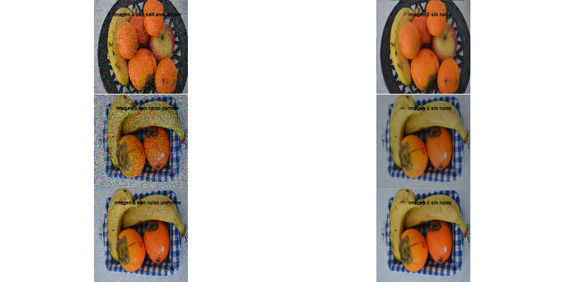
```


Redimensionamos las imágenes obtenidas a su tamaño original para poder compararlas con estas. Vemos que en este caso la eliminación de ruido ha sido bastante buena y no hay apenas distorsión ni suavizado de los bordes.
```{r, message = FALSE}
images_sin_ruido <- Map(resize_imwd_to_original, images_sin_ruidos, c("2", "3", "3") )
```

```{r}
png("imwd/image1_otros_ruidos_original.png", width = 800, height = 400)
par(mfrow = c(3, 2), cex = 0.5)

EBImage::display(Image(images[[2]], colormode = 'Color'), method='r')
title('Imagen 2 original')
EBImage::display(Image(images_sin_ruido[[1]], colormode = 'Color'), method='r')
title('Imagen 2 sin ruido')

EBImage::display(Image(images[[3]], colormode = 'Color'), method='r')
title('Imagen 3 original')
EBImage::display(Image(images_sin_ruido[[2]], colormode = 'Color'), method='r')
title('Imagen 3 sin ruido')

EBImage::display(Image(images[[3]], colormode = 'Color'), method='r')
title('Imagen 3 original')
EBImage::display(Image(images_sin_ruido[[3]], colormode = 'Color'), method='r')
title('Imagen 3 sin ruido')
dev.off()
```

```{r, eval = TRUE, out.height="25%"}
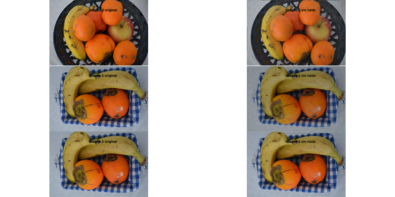
```

```{r}
rm(images_recortadas, images_sin_ruido, images_sin_ruidos)
```

### Ampliando las imágenes

Vamos a emplear ahora el otro método: aumentando la matriz con 0 hasta el tamaño adecuado para poder aplicar la función `imwd`. Comenzamos generando las imágenes con ruido. Se elige la foto con menor resolución (imagen 5) porque, al aplicar la función a fotos con mayor cantidad de píxeles, se genera un problema con el uso de la memoria en R para cargarlas debido a que la matriz se hace demasiado grande. 

```{r,echo=FALSE, eval = TRUE}
gaussian_noise_5<-add_noise_to_image("5", "gaussian", list(std_dev = 0.5))
sinu_high_noise_5<-add_noise_to_image("5", "sinusoidal_high", list(frequency = 25, amplitude = 0.2))
sinu_low_noise_5<-add_noise_to_image("5", "sinusoidal_low", list(frequency = 2, amplitude = 0.2))
salt_pepper_noise_5<-add_noise_to_image("5", "salt_pepper", list(epsilon = 0.1))
gamma_noise_5<-add_noise_to_image("5", "gamma", list(looks = 2))
unif_noise_5<-add_noise_to_image("5", "uniform_multiplicative", list(looks = 2))
```


```{r,echo=FALSE, eval = TRUE}

imagen_noise <- list(gaussian_noise_5,sinu_high_noise_5,sinu_low_noise_5,salt_pepper_noise_5, gamma_noise_5, unif_noise_5)
names(imagen_noise) <- c('Noise: gaussian', 'Noise: sinusoidal_high','Noise: sinusoidal_low','Noise: salt_pepper', 
                         'Noise: gamma', 'Noise: unif')
```

Se genera una función que ajusta cualquier imagen rectangular a un tamaño cuadrado. La diferencia con el método empleando `resize` es que mantiene sus proporciones originales al agregar relleno si es necesario. Esta transformación asegura que la imagen sea compatible con `imwd`.

```{r,echo=FALSE, eval = TRUE}
hacer_cuadrada_potencia_2 <- function(imagen) {
  n_filas <- dim(imagen)[1]
  n_columnas <- dim(imagen)[2]
  
  nuevo_tamano <- max(n_filas, n_columnas)
  
  siguiente_potencia_2 <- 2^ceiling(log2(nuevo_tamano))
  
  imagen_cuadrada <- array(0, dim = c(siguiente_potencia_2, siguiente_potencia_2, dim(imagen)[3])) 
  
  imagen_cuadrada[1:n_filas, 1:n_columnas, ] <- imagen
  
  return(imagen_cuadrada)
}

```

Aplicamos esta función a la imagen 5 con los distintos tipos de ruido.

```{r,echo=FALSE, message = FALSE, eval = TRUE}
fotos_cuadradas <- lapply(imagen_noise, hacer_cuadrada_potencia_2)
```

La imagen pasa de tener tamaño 1.600x1.066 en cada dimensión de color a 2.048x2.048, habiendo rellenado este espacio con espacio negro. 


```{r,echo=FALSE}
str(imagen_noise)
```


```{r,echo=FALSE}
str(fotos_cuadradas)
```

```{r,echo=FALSE}
# Mostrar imagebes
#par(mfrow = c(1, 2))  # 1 fila, 2 columnas

# Mostrar la foto original
#foto_original<-hacer_cuadrada_potencia_2(images[[5]])

#EBImage::display(Image(foto_original, colormode = 'Color'), method = 'r')
#mtext("Imagen aumentada en potencia 2", side = 3, line = 1.5, cex = 1)

#i=1

#EBImage::display(Image(fotos_cuadradas[[i]], colormode = 'Color'), method = 'r')
#mtext(names(fotos_cuadradas)[i], side = 3, line = 1.5, cex = 1)

#par(mfrow = c(1, 1))

```

```{r,echo=FALSE}

#for(i in c(1:5)){
#prueba<-procesar_imagen_wavelet(fotos_cuadradas[[i]], tipo = "hard", policy = #"universal")
#EBImage::display(prueba[1:1600,1:1000,], method = 'r', title = 'Imagen Wavelet sin #ruido')
#mtext(names(fotos_cuadradas)[i], side = 3, line = 3.2, cex = 1)

#}
```

 Una vez tenemos las imágenes con ruido generadas y ampliadas en potencia de 2, aplicamos la función imwd a cada uno de los tres canales (R, G y B). Usando la función procesar_imagen_wavelet que devuelve las imágenes reconstruidas después del thresholding.
 
Aplicamos en cada ruido dos técnicas para seleccionar el umbral: Universal y fdr, además especificamos que el umbral sea 'hard'. Las imagenes se presentan sin el relleno para que sea más fácil de visualizar. 
 

```{r,echo= FALSE, eval = TRUE}
suppressMessages(library(EBImage))

library(magick)
imprimir<-function(i){
# Crear la imagen original (con ruido)
ruido1 <- Image(fotos_cuadradas[[i]], colormode = 'Color')
img_raster <- as.raster(ruido1)
img_magick1 <- image_read(img_raster)

# Recortar la imagen a 1300x1200 desde la esquina superior izquierda
img_magick1_recortada <- image_crop(img_magick1, "1600x1060+10+10")

# Dibujar el título sobre la imagen recortada
img_magick1_recortada <- image_draw(img_magick1_recortada)
text(x = 320, y = 20, labels = paste0(names(fotos_cuadradas)[i]), col = "white", cex = 5)  # Ajusta la posición y el tamaño
dev.off()  # Termina de dibujar en la imagen

# Puedes continuar con el mismo proceso para las otras imágenes
# Recortar las imágenes procesadas y añadirles títulos

ruido1_universal <- procesar_imagen_wavelet(fotos_cuadradas[[i]], tipo = "hard", policy = "universal")
img_raster <- as.raster(ruido1_universal)
img_magick2 <- image_read(img_raster)

# Recortar la imagen procesada
img_magick2_recortada <- image_crop(img_magick2, "1600x1060+10+10")

# Dibujar el título sobre la imagen recortada
img_magick2_recortada <- image_draw(img_magick2_recortada)
text(x = 320, y = 20, labels = "Wavelet - Universal", col = "white", cex = 5) 
dev.off()

ruido1_fdr <- procesar_imagen_wavelet(fotos_cuadradas[[i]], tipo = "hard", policy = "fdr")
img_raster <- as.raster(ruido1_fdr)
img_magick3 <- image_read(img_raster)

# Recortar la imagen procesada
img_magick3_recortada <- image_crop(img_magick3, "1600x1060+10+10")

# Dibujar el título sobre la imagen recortada
img_magick3_recortada <- image_draw(img_magick3_recortada)
text(x = 320, y = 20, labels = "Wavelet - FDR", col = "white", cex = 5) 
dev.off()

# Combinar las tres imágenes recortadas
imagen_combinada_recortada <- image_append(c(img_magick1_recortada, img_magick2_recortada, img_magick3_recortada))

# Mostrar la imagen combinada recortada
return(imagen_combinada_recortada)
}
```

Recordemos que la imagen 5 es la de menor resolución, por lo que, al eliminar el ruido, los cambios no son tan notorios como en otras imágenes.

Eliminar Ruido Gaussiano: Se observa que al eliminar el ruido gaussiano el umbral FDR podría ofrecer una ligera mejora en la eliminación de ruido en comparación con el umbral Universal, sin embargo al observar más de cerca vemos que al parecer el ruido no se ha eliminado completamente.
 
```{r,echo=FALSE, eval = TRUE, out.height="10%"}
suppressMessages(imprimir(1))
```

                         
Eliminar Ruido Sinusoidal de alta frecuencia: Al igual que en el ruido gaussiano, se observa que el umbral FDR no logra eliminar y el ruido es bastante evidente.
 
```{r,echo=FALSE, eval = TRUE, out.height="10%"}
suppressMessages(imprimir(2))
```

Eliminar Ruido Sinusoidal de baja frecuencia: En este caso es muy dificil observar diferencias, ambos umbrales no funcionan bien.
```{r,echo=FALSE, eval = TRUE, out.height="10%"}
suppressMessages(imprimir(3))
```

En los casos de ruido tipo 'salt and pepper' y uniforme, se observa que el ruido se elimina en universal , sin embargo en FDR se mantiene.

Eliminar Ruido Salt and pepper: 
```{r,echo=FALSE, eval = TRUE, out.height="10%"}
suppressMessages(imprimir(4))
```


Eliminar  Ruido uniforme:
```{r,echo=FALSE, eval = TRUE, out.height="10%"}
suppressMessages(imprimir(6))
```

En el caso de ruido gamma, no se logra una eliminación adecuada con FDR, y el método universal parece ofrecer mejores resultados.

Eliminar Ruido gamma:
```{r,echo=FALSE, eval = TRUE, out.height="10%"}
suppressMessages(imprimir(5))
```

El umbral Universal emplea un valor fijo basado en el tamaño de la señal, lo que limita su capacidad para capturar completamente la variabilidad del ruido. En contraste, FDR estima la probabilidad de que un coeficiente wavelet provenga del ruido, lo que le permite adaptarse mejor a las características específicas de la señal. Como resultado, FDR puede ofrecer una eliminación de ruido más adaptativa, preservando mejor los detalles de la imagen. sin embargo esto provoca que el ruido no sea completamente eliminado en las imagenes. .


```{r,echo=FALSE}
library(magick)

imprimir_ajustes <- function(i) {
  
  # Crear la imagen original (con ruido)
  ruido1 <- Image(fotos_cuadradas[[i]], colormode = 'Color')
  img_raster <- as.raster(ruido1)
  img_magick1 <- image_read(img_raster)
  
  # Recortar la imagen a 1600x1060 desde la esquina superior izquierda
  img_magick1_recortada <- image_crop(img_magick1, "1600x1060+10+10")
  
  # Dibujar el título sobre la imagen recortada
  img_magick1_recortada <- image_draw(img_magick1_recortada)
  text(x = 200, y = 20, labels = paste0(names(fotos_cuadradas)[i]), col = "white", cex = 3.5)  
  dev.off()  
  
  # Procesar imagen con filtro Wavelet FDR
  ruido1_fdr <- procesar_imagen_wavelet(fotos_cuadradas[[i]], tipo = "hard", policy = "fdr")
  img_raster <- as.raster(ruido1_fdr)
  img_magick3 <- image_read(img_raster)
  img_magick3_recortada <- image_crop(img_magick3, "1600x1060+10+10")
  img_magick_recortada <- image_crop(img_magick3, "1600x1060+10+10")

  # Dibujar título "Wavelet - FDR" sobre la imagen recortada
  img_magick3_recortada <- image_draw(img_magick3_recortada)
  text(x = 200, y = 20, labels = "Wavelet - FDR", col = "white", cex = 3.5)  
  dev.off()  # Termina de dibujar en la imagen
  
  # Aplicar filtro de kernel paso alto
  kernel_paso_alto <- matrix(c(0, -1, 0, -1, 5, -1, 0, -1, 0), nrow = 3, ncol = 3)
  filtrada_alto <- image_convolve(img_magick_recortada, kernel_paso_alto)
  
  # Agregar título "Filtro Alto" sobre la imagen filtrada con el filtro de paso alto
  filtrada_alto <- image_draw(filtrada_alto)
  text(x = 200, y = 20, labels = "Filtro Alto", col = "white", cex = 3.5)  # Título "Filtro Alto"
  dev.off()  # Termina de dibujar en la imagen
  
  # Aplicar contraste a la imagen
  concontraste <- image_contrast(img_magick_recortada)
  concontraste <- image_draw(concontraste)
  text(x = 200, y = 20, labels = "Contraste", col = "white", cex = 3.5)  # Título "Filtro Alto"
  dev.off() 
  
  # Combinar las tres imágenes (Wavelet, Filtro Alto, y Contraste)
  imagen_combinada_recortada <- image_append(c(img_magick_recortada3, filtrada_alto, concontraste))
  
  # Mostrar la imagen combinada recortada
  return(imagen_combinada_recortada)
}

```


```{r,echo=FALSE}
#suppressMessages(imprimir_ajustes(1))
```

```{r,echo=FALSE}
#suppressMessages(imprimir_ajustes(2))
```

```{r,echo=FALSE}
#suppressMessages(imprimir_ajustes(3))
```

```{r,echo=FALSE}
#suppressMessages(imprimir_ajustes(4))
```

```{r,echo=FALSE}
#suppressMessages(imprimir_ajustes(5))
```

```{r,echo=FALSE}
#suppressMessages(imprimir_ajustes(6))
```


## Función denoise.dwt.2d

En segundo lugar, vamos a emplear la función `denoise.dwt.2d`, un método más directo que realiza la transformada wavelet, el thresholding y la transformada inversa mediante esta función ya implementada en R.

Modificaremos distintos argumentos de esta función para comparar los resultados:

* Reglas de umbral (`rule`):

  + hard: Anula los coeficientes por debajo del umbral, asígnándoles valor 0. Es una opción más agresiva.
  + soft: En lugar de anular directamente los coeficientes, les otorga un valor gradual en función de su cercanía al umbral. Permite una reducción del ruido menos abrupta.
  
* Niveles de descomposición (`J`):

Probaremos con 2, 3 y 4 niveles de descomposición. El ruido suele encontrarse en las altas frecuencias de los niveles más bajos, mientras que en los niveles altos se encuentran los detalles más finos. Esperamos que un mayor nivel de descomposición genere imágenes más suavizadas, pero con menos detalles.

```{r, eval=TRUE}
# establecemos los parámetros
nivel <- c(2, 3, 4)
umbral <- c("soft", "hard")
```

* Filtros wavelet (`wf`): 

Finalmente, realizaremos la descomposición de la imagen con 4 filtros wavelet distintos, 4 wavelets con diferentes formas (pueden ser simétricas o no), y diferente numero de coeficientes (suavidad).

* d4 (Daubechies 4),la8 (Least Asymmetric 8), bl14 (Best Localized 14), mb8 (Maximum Flat 8)

```{r, out.width="60%", out.height="20%"}

# dir.create("denoisedwt2d", showWarnings = FALSE)

png("denoisedwt2d/wavelet_filters.png", width = 800, height = 400)

filtro <- c('d4', 'la8', 'bl14', 'mb8')

par(mfrow = c(2, 4))
for (f in filtro) {
  # Obtener los coeficientes del filtro wavelet
  wavelet_filter <- wave.filter(f)
  
  # Ajustar coeficientes para que empiecen y terminen en 0
  h_adjusted <- c(0, wavelet_filter$hpf, 0)
  g_adjusted <- c(0, wavelet_filter$lpf, 0)
  
  # Calcular el rango simétrico para el eje Y
  max_val <- max(abs(c(h_adjusted, g_adjusted)))
  y_lim <- c(-max_val, max_val)
  
  # Graficar
  plot(h_adjusted, type = "l", main = paste("Paso alto", f),
       xlab = "Índice", ylab = "Amplitud", col = "blue", lwd = 2,
       ylim = y_lim)
  plot(g_adjusted, type = "l", main = paste("Paso bajo", f),
       xlab = "Índice", ylab = "Amplitud", col = "red", lwd = 2,
       ylim = y_lim)
}

dev.off()
```

```{r}
rm(h_adjusted)
rm(g_adjusted)
rm(max_val)
rm(y_lim)
```

```{r, eval = TRUE, out.width="50%"}
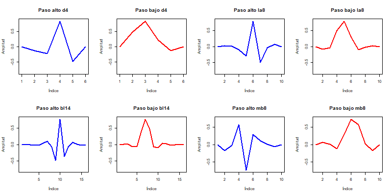
```

Dado que se han realizado múltiples pruebas y los resultados son muy similares, se muestran solo aquellos que se han considerado más relevantes.

Primero, mostramos el resultado del proceso de eliminación del ruido de la imagen 1, a la que se le añadió ruido gaussiano. Este caso se utiliza como ejemplo porque ilustra las conclusiones que generalmente son válidas para el resto de imágenes y tipos de ruido.

```{r}
# Para evitar largos tiempos de procesado, se generaron las imágenes y se almacenaron en la carpeta denoisedwt2d, y serán las imagenes guardadas las que se muestren en el markdown.

png("denoisedwt2d/gaussian.png", width = 800, height = 400)

i_sinruido <- images[[1]]
i_ruidosa <-  add_noise_to_image("1", "gaussian", list(std_dev = 0.3))

i_dim <- dim(i_sinruido)
i_len <- length(i_sinruido)

i_denoised <- array(0, dim = dim(i_ruidosa))

par(mfrow= c(1,2))
display(Image(i_sinruido, colormode = "Color"), method = "r")
title("Original")
display(Image(i_ruidosa, colormode = "Color"), method = "r")
title("Imagen con ruido")

dev.off()
png("denoisedwt2d/gaussian_denoised.png", width = 1200, height = 1800)

par(mfcol= c(6,4))
for (f in filtro){
  for (n in nivel){
    for (u in umbral){
      canal1 <- denoise.dwt.2d(i_ruidosa[,,1], wf = f, rule = u, J = n)
      canal2 <- denoise.dwt.2d(i_ruidosa[,,2], wf = f, rule = u, J = n)
      canal3 <- denoise.dwt.2d(i_ruidosa[,,3], wf = f, rule = u, J = n)
      i_denoised <- array(c(canal1, canal2, canal3), dim = c(nrow(canal1), ncol(canal1), 3))

      display(Image(i_denoised, colormode = "Color"), method = "r")
      title(paste0("Wavelet ", f, ", umbral " , u, ", nivel ", n))
    }}}

dev.off()
```

```{r, eval = TRUE, out.width="40%"}
knitr::include_graphics("denoisedwt2d/gaussian.png")
```

```{r, eval= TRUE, out.height="80%"}
include_graphics("denoisedwt2d/gaussian_denoised.png")

```

Se observa que el uso de los diferentes filtros wavelet y reglas de aplicación del umbral no genera resultados con diferencias significativas. Sin embargo, el nivel de descomposición sí tiene un impacto notable.

Con un menor número de niveles (2-3), se logran conservar los detalles de la imagen, pero el ruido no se elimina completamente, con solo 2 niveles, el ruido sigue siendo evidente. Al aumentar a 4 niveles, se obtiene una imagen en la que el ruido es prácticamente inapreciable, aunque aparece algo más suavizada. Si se aumentaran aún más los niveles de descomposición, se empezarían a perder detalles importantes de la imagen. Con 4 niveles se consigue un buen equilibrio entre la eliminación del ruido y la conservación de los detalles. Este comportamiento se repite en los distintos tipos de ruido analizados.

A continuación se muestran algunas particularidades relevantes de los resultados obtenidos: 

Por ejemplo, en el caso del ruido sinusoidal de alta frecuencia, el resultado del proceso de eliminación de ruido es distinto.

```{r}
png("denoisedwt2d/sinhigh.png", width = 800, height = 400)

i_sinruido <- images[[2]]
i_ruidosa <- add_noise_to_image("2", "sinusoidal_high", list(frequency = 25, amplitude = 0.2))

i_dim <- dim(i_sinruido)
i_len <- length(i_sinruido)

i_denoised <- array(0, dim = dim(i_ruidosa))

par(mfrow= c(1,2))
display(Image(i_sinruido, colormode = "Color"), method = "r")
title("Original")
display(Image(i_ruidosa, colormode = "Color"), method = "r")
title("Imagen con ruido")

dev.off()
png("denoisedwt2d/sinhigh_denoised.png", width = 1200, height = 1800)

par(mfcol= c(6,4))
for (f in filtro){
  for (n in nivel){
    for (u in umbral){
      canal1 <- denoise.dwt.2d(i_ruidosa[,,1], wf = f, rule = u, J = n)
      canal2 <- denoise.dwt.2d(i_ruidosa[,,2], wf = f, rule = u, J = n)
      canal3 <- denoise.dwt.2d(i_ruidosa[,,3], wf = f, rule = u, J = n)
      i_denoised <- array(c(canal1, canal2, canal3), dim = c(nrow(canal1), ncol(canal1), 3))

      display(Image(i_denoised, colormode = "Color"), method = "r")
      title(paste0("Wavelet ", f, ", umbral " , u, ", nivel ", n))
  }}}

dev.off()
```

```{r, eval = TRUE, out.width="40%"}

```

```{r}

```


```{r}

png("denoisedwt2d/sinhigh_denoised_show.png", width = 1200, height = 600)

par(mfcol= c(2,4))
for (f in filtro){
  for (u in umbral){
      canal1 <- denoise.dwt.2d(i_ruidosa[,,1], wf = f, rule = u, J = 4)
      canal2 <- denoise.dwt.2d(i_ruidosa[,,2], wf = f, rule = u, J = 4)
      canal3 <- denoise.dwt.2d(i_ruidosa[,,3], wf = f, rule = u, J = 4)
      i_denoised <- array(c(canal1, canal2, canal3), dim = c(nrow(canal1), ncol(canal1), 3))

      display(Image(i_denoised, colormode = "Color"), method = "r")
      title(paste0("Wavelet ", f, ", umbral " , u, ", nivel ", 4))
  }}

dev.off()

```

```{r, eval = TRUE, out.width="80%"}

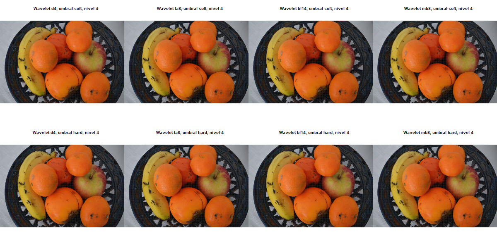

```

En este caso, vemos que en ninguno de los casos logramos eliminar completamente el ruido sinusoidal. Esto puede deberse a que este tipo de ruido presenta componentes muy específicas de alta frecuencia, que pueden coincidir con las frecuencias de los detalles importantes de la imagen, lo que dificulta eliminar el ruido sin comprometer los detalles de la imagen. El ruido sinusoidal era también el más complicado de eliminar cuándo aplicabamos la función `imwd` y `threshold`.


```{r}
png("denoisedwt2d/sinlow.png", width = 800, height = 400)

i_sinruido <- images[[3]]
i_ruidosa <- add_noise_to_image("3", "sinusoidal_low", list(frequency = 5, amplitude = 0.2))

i_dim <- dim(i_sinruido)
i_len <- length(i_sinruido)

i_denoised <- array(0, dim = dim(i_ruidosa))

par(mfrow= c(1,2))
display(Image(i_sinruido, colormode = "Color"), method = "r")
title("Original")
display(Image(i_ruidosa, colormode = "Color"), method = "r")
title("Imagen con ruido")

dev.off()
png("denoisedwt2d/sinlow_denoised.png", width = 1200, height = 1800)

par(mfcol= c(6,4))
for (f in filtro){
  for (n in nivel){
    for (u in umbral){
      canal1 <- denoise.dwt.2d(i_ruidosa[,,1], wf = f, rule = u, J = n)
      canal2 <- denoise.dwt.2d(i_ruidosa[,,2], wf = f, rule = u, J = n)
      canal3 <- denoise.dwt.2d(i_ruidosa[,,3], wf = f, rule = u, J = n)
      i_denoised <- array(c(canal1, canal2, canal3), dim = c(nrow(canal1), ncol(canal1), 3))

      display(Image(i_denoised, colormode = "Color"), method = "r")
      title(paste0("Wavelet ", f, ", umbral " , u, ", nivel ", n))
  }}}

dev.off()

```

```{r, out.width="40%"}
knitr::include_graphics("denoisedwt2d/sinlow.png")
```

```{r, out.height="80%"}

```

Otro ruido que tiene resultados peculiares es el ruido de tipo salt-and-pepper.

```{r}
png("denoisedwt2d/pepper.png", width = 800, height = 400)

i_sinruido <- images[[4]]
i_ruidosa <- add_noise_to_image("4", "salt_pepper", list(epsilon = 0.1))

i_dim <- dim(i_sinruido)
i_len <- length(i_sinruido)

i_denoised <- array(0, dim = dim(i_ruidosa))

par(mfrow= c(1,2))
display(Image(i_sinruido, colormode = "Color"), method = "r")
title("Original")
display(Image(i_ruidosa, colormode = "Color"), method = "r")
title("Imagen con ruido")

dev.off()

png("denoisedwt2d/pepper_denoised.png", width = 1200, height = 1800)

par(mfcol= c(6,4))
for (f in filtro){
  for (n in nivel){
    for (u in umbral){
      canal1 <- denoise.dwt.2d(i_ruidosa[,,1], wf = f, rule = u, J = n)
      canal2 <- denoise.dwt.2d(i_ruidosa[,,2], wf = f, rule = u, J = n)
      canal3 <- denoise.dwt.2d(i_ruidosa[,,3], wf = f, rule = u, J = n)
      i_denoised <- array(c(canal1, canal2, canal3), dim = c(nrow(canal1), ncol(canal1), 3))

      display(Image(i_denoised, colormode = "Color"), method = "r")
      title(paste0("Wavelet ", f, ", umbral " , u, ", nivel ", n))
  }}}

dev.off()
```

```{r, eval = TRUE, out.width="40%"}

```


```{r, out.height="80%"}
include_graphics("denoisedwt2d/pepper_denoised.png")

```

```{r}

png("denoisedwt2d/pepper_denoised_show.png", width = 1200, height = 600)

par(mfcol= c(2,4))
for (f in filtro){
  for (u in umbral){
      canal1 <- denoise.dwt.2d(i_ruidosa[,,1], wf = f, rule = u, J = 4)
      canal2 <- denoise.dwt.2d(i_ruidosa[,,2], wf = f, rule = u, J = 4)
      canal3 <- denoise.dwt.2d(i_ruidosa[,,3], wf = f, rule = u, J = 4)
      i_denoised <- array(c(canal1, canal2, canal3), dim = c(nrow(canal1), ncol(canal1), 3))

      display(Image(i_denoised, colormode = "Color"), method = "r")
      title(paste0("Wavelet ", f, ", umbral " , u, ", nivel ", 4))
  }}

dev.off()

```

```{r, eval = TRUE, out.width="80%"}

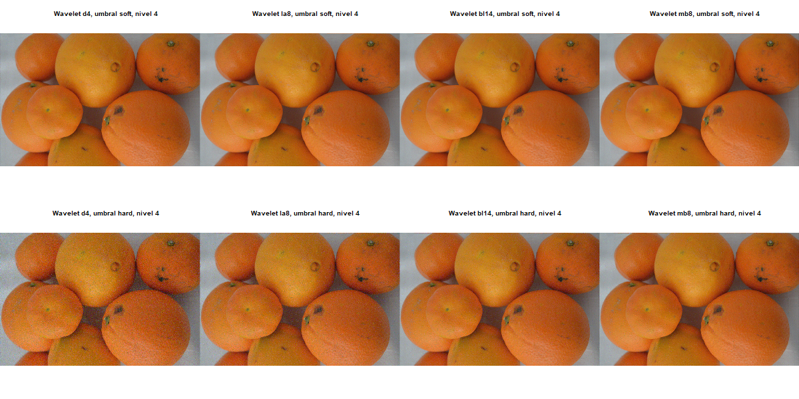

```

En este caso, observamos diferencias sutiles en los resultados en cuanto a:

* La regla de aplicación del umbral: Al utilizar la regla soft, se consigue una mejor eliminación del ruido. Esto podría deberse a que el ruido salt and pepper asigna valores extremos (cercanos a 0 y 1) a algunos píxeles. Al aplicar el método hard, no se atenúan adecuadamente los picos de ruido debido a su naturaleza más agresiva.

* El filtro wavelet empleado: El rendimiento con el filtro d4 es inferior al de otros filtros. Esto se debe a que el filtro d4 es un filtro corto (solo 4 coeficientes) y tiene una resolución de frecuencia limitada. Como resultado, no puede capturar eficazmente los picos abruptos de este tipo de ruido

```{r, out.width="50%", out.height="70%"}

png("denoisedwt2d/gamma.png", width = 800, height = 400)

i_sinruido <- images[[1]]
i_ruidosa <- add_noise_to_image("1", "gamma", list(looks = 2))

i_dim <- dim(i_sinruido)
i_len <- length(i_sinruido)

i_denoised <- array(0, dim = dim(i_ruidosa))

par(mfrow= c(1,2))
display(Image(i_sinruido, colormode = "Color"), method = "r")
title("Original")
display(Image(i_ruidosa, colormode = "Color"), method = "r")
title("Imagen con ruido")

dev.off()
png("denoisedwt2d/gamma_denoised.png", width = 1200, height = 1800)

par(mfcol= c(6,4))
for (f in filtro){
  for (n in nivel){
    for (u in umbral){
      canal1 <- denoise.dwt.2d(i_ruidosa[,,1], wf = f, rule = u, J = n)
      canal2 <- denoise.dwt.2d(i_ruidosa[,,2], wf = f, rule = u, J = n)
      canal3 <- denoise.dwt.2d(i_ruidosa[,,3], wf = f, rule = u, J = n)
      i_denoised <- array(c(canal1, canal2, canal3), dim = c(nrow(canal1), ncol(canal1), 3))

      display(Image(i_denoised, colormode = "Color"), method = "r")
      title(paste0("Wavelet ", f, ", umbral " , u, ", nivel ", n))
  }}}

dev.off()

include_graphics("denoisedwt2d/gamma.png")
include_graphics("denoisedwt2d/gamma_denoised.png")

```

```{r, out.width="50%", out.height="70%"}

png("denoisedwt2d/multiplicative.png", width = 800, height = 400)

i_sinruido <- images[[2]]
i_ruidosa <- add_noise_to_image("2", "uniform_multiplicative", list(looks = 2))

i_dim <- dim(i_sinruido)
i_len <- length(i_sinruido)

i_denoised <- array(0, dim = dim(i_ruidosa))

par(mfrow= c(1,2))
display(Image(i_sinruido, colormode = "Color"), method = "r")
title("Original")
display(Image(i_ruidosa, colormode = "Color"), method = "r")
title("Imagen con ruido")

dev.off()
png("denoisedwt2d/multiplicative_denoised.png", width = 1200, height = 1800)

par(mfcol= c(6,4))
for (f in filtro){
  for (n in nivel){
    for (u in umbral){
      canal1 <- denoise.dwt.2d(i_ruidosa[,,1], wf = f, rule = u, J = n)
      canal2 <- denoise.dwt.2d(i_ruidosa[,,2], wf = f, rule = u, J = n)
      canal3 <- denoise.dwt.2d(i_ruidosa[,,3], wf = f, rule = u, J = n)
      i_denoised <- array(c(canal1, canal2, canal3), dim = c(nrow(canal1), ncol(canal1), 3))

      display(Image(i_denoised, colormode = "Color"), method = "r")
      title(paste0("Wavelet ", f, ", umbral " , u, ", nivel ", n))
  }}}

dev.off()

include_graphics("denoisedwt2d/multiplicative.png")
include_graphics("denoisedwt2d/multiplicative_denoised.png")

```

Por último, presentamos los resultados del proceso de denoising de la imagen 5, a la que se le ha aplicado ruido gaussiano. A diferencia de la imagen 1, en este caso la resolución de la imagen es considerablemente inferior, lo que parece influir en los resultados obtenidos.

```{r,  out.width="50%", out.height="70%"}
png("denoisedwt2d/image5_noise.png", width = 800, height = 400)

i_sinruido <- images[[5]]
i_ruidosa <- add_noise_to_image("5", "gaussian", list(std_dev = 0.3))

i_dim <- dim(i_sinruido)
i_len <- length(i_sinruido)

i_denoised <- array(0, dim = dim(i_ruidosa))

par(mfrow= c(1,2))
display(Image(i_sinruido, colormode = "Color"), method = "r")
title("Original")
display(Image(i_ruidosa, colormode = "Color"), method = "r")
title("Imagen con ruido")

dev.off()
png("denoisedwt2d/image5_denoised.png", width = 1200, height = 1800)

par(mfcol= c(6,4))
for (f in filtro){
  for (n in nivel){
    for (u in umbral){
      canal1 <- denoise.dwt.2d(i_ruidosa[,,1], wf = f, rule = u, J = n)
      canal2 <- denoise.dwt.2d(i_ruidosa[,,2], wf = f, rule = u, J = n)
      canal3 <- denoise.dwt.2d(i_ruidosa[,,3], wf = f, rule = u, J = n)
      i_denoised <- array(c(canal1, canal2, canal3), dim = c(nrow(canal1), ncol(canal1), 3))

      display(Image(i_denoised, colormode = "Color"), method = "r")
      title(paste0("Wavelet ", f, ", umbral " , u, ", nivel ", n))
  }}}

dev.off()
```


```{r, eval = TRUE, out.width="50%"}
knitr::include_graphics("denoisedwt2d/image5_noise.png")
```


```{r, out.height="70%"}
include_graphics("denoisedwt2d/image5_denoised.png")

```

```{r}

png("denoisedwt2d/image5_denoised_show.png", width = 800, height = 600)

par(mfcol= c(2,3))
for (n in nivel){
  for (u in umbral){
    canal1 <- denoise.dwt.2d(i_ruidosa[,,1], wf = "d4", rule = u, J = n)
    canal2 <- denoise.dwt.2d(i_ruidosa[,,2], wf = "d4", rule = u, J = n)
    canal3 <- denoise.dwt.2d(i_ruidosa[,,3], wf = "d4", rule = u, J = n)
    i_denoised <- array(c(canal1, canal2, canal3), dim = c(nrow(canal1), ncol(canal1), 3))

    display(Image(i_denoised, colormode = "Color"), method = "r")
    title(paste0("Wavelet ", "d4", ", umbral " , u, ", nivel ", n))
  }}

dev.off()

```

```{r, eval = TRUE, out.width="80%"}

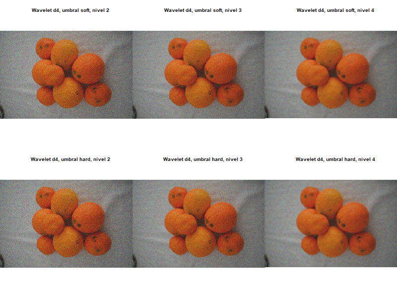

```
La diferencia más notable en comparación con el resto de resultados, es que en este caso, al aumentar el numero de niveles de descomposición a un número que nos permita eliminar la mayor parte del ruido, la calidad de la imagen se ve significativamente afectada, y obtenemos una imagen excesivamente suavizada. Esto puede deberse a que a medida que aumentan los niveles de descomposición, la imagen se descompone en frecuencias cada vez más altas, provocando la pérdida de detalles finos.

La baja resolución de la imagen hace que sea más difícil mantener un equilibrio entre la eliminación del ruido y la preservación de los detalles. Al aumentar los niveles de descomposición, el ruido se elimina en mayor medida, pero también se pierde mucha información útil.

```{r, eval = TRUE, warning=FALSE}
rm(filtro, nivel, umbral, wavelet_filter)
```


## Transformada de Fourier

Por último, vamos a ver que es lo que ocurre cuando en lugar de transformadas wavelet empleamos transformadas de fourier.
```{r}
p_load(gsignal, fields)
```

Comenzamos probando con la imagen 1 y el ruido gaussiano. Se realiza la transformada de fourier y en el espacio de frecuencias se representan las frecuencias bajas en el centro y las altas en los extremos. El ruido, generalemente asociado a frecuencias altas, se intetará eliminar reduciendo las frecuencias altas.


```{r echo=F, eval = FALSE}
imgr <- add_noise_to_image("1", "gaussian", list(std_dev = 0.3))

# CANAL ROJO

fft_r <- fft(imgr[,,1])
n_r <- length(fft_r)

fshift_r <- gsignal::fftshift(fft_r, MARGIN = c(1,2))
spectr_r <- 20*log10(Mod(fshift_r))

# fields::image.plot(spectr1_r)

# CANAL VERDE

fft_g <- fft(imgr[,,2])
n_g <- length(fft_g)

fshift_g <- gsignal::fftshift(fft_g, MARGIN = c(1,2))
spectr_g <- 20*log10(Mod(fshift_g))

# fields::image.plot(spectr_g)

# CANAL AZUL

fft_b <- fft(imgr[,,3])
n_b <- length(fft_b)

fshift_b <- gsignal::fftshift(fft_b, MARGIN = c(1,2))
spectr_b <- 20*log10(Mod(fshift_b))

#fields::image.plot(spectr_b)
```

```{r echo=F, eval = FALSE}

# CANAL ROJO

small <- 10

fshift_r[0:6000, 0:1200] <- small
fshift_r[0:6000, 2800:4000] <- small
fshift_r[0:2500, 1200:2800] <- small
fshift_r[3500:6000, 1200:2800] <- small

spectr_shifted_r <- 20*log10(Mod(fshift_r))

# fields::image.plot(spectr_shifted_r)

# CANAL VERDE

fshift_g[0:6000, 0:1200] <- small
fshift_g[0:6000, 2800:4000] <- small
fshift_g[0:2500, 1200:2800] <- small
fshift_g[3500:6000, 1200:2800] <- small

spectr_shifted_g <- 20*log10(Mod(fshift_g))

# fields::image.plot(spectr_shifted_g)

# CANAL AZUL

fshift_b[0:6000, 0:1200] <- small
fshift_b[0:6000, 2800:4000] <- small
fshift_b[0:2500, 1200:2800] <- small
fshift_b[3500:6000, 1200:2800] <- small

spectr_shifted_b <- 20*log10(Mod(fshift_b))

# fields::image.plot(spectr_shifted_b)

```

```{r echo=F, eval = FALSE}
fftmod_r <- gsignal::ifftshift(fshift_r, MARGIN = c(1,2))
img_r <- Re(fft(fftmod_r, inverse = T)) / prod(dim(fftmod_r))
fftmod_g <- gsignal::ifftshift(fshift_g, MARGIN = c(1,2))
img_g <- Re(fft(fftmod_g, inverse = T)) / prod(dim(fftmod_g))
fftmod_b <- gsignal::ifftshift(fshift_b, MARGIN = c(1,2))
img_b <- Re(fft(fftmod_b, inverse = T)) / prod(dim(fftmod_b))

img <- array(0, dim = dim(imgr))
img[,,1] <- img_r
img[,,2] <- img_g
img[,,3] <- img_b

```


```{r echo=F, eval = FALSE}

png("fftshift/image1_fourier.png", width = 700, height = 350)
par(mfrow = c(1, 2), cex = 0.5)

EBImage::display(Image(imgr, colormode = 'Color'), method='r')
title('Imagen 1 con ruido gaussiano')
EBImage::display(Image(img, colormode = 'Color'), method='r')
title('Imagen 1 sin ruido')


dev.off()
# plot(Image((imgr), colormode = "Color"))
# plot(Image((img), colormode = "Color"))
```
```{r, eval = TRUE, out.width="60%", out.height="60%"}
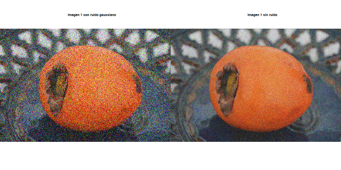
```


```{r echo=F,  eval = FALSE}
rm(imgr, fft_r, n_r, fshift_r, spectr_r, fft_g, n_g, fshift_g, spectr_g, 
   fft_b, n_b, fshift_b, spectr_b, small, spectr_shifted_r, spectr_shifted_g,
   spectr_shifted_b, fftmod_r, fftmod_g, fftmod_b, img_r, img_g, img_b, img)
```


La siguiente prueba se ha realizado con la imagen 2 y ruido sinusoidal alto. Este tipo de ruido es el que más problemas generó con el primer método.


```{r echo=F,  eval = FALSE}
imgr <- add_noise_to_image("2", "sinusoidal_high", list(frequency = 25, amplitude = 0.2))

# CANAL ROJO

fft_r <- fft(imgr[,,1])
n_r <- length(fft_r)

fshift_r <- gsignal::fftshift(fft_r, MARGIN = c(1,2))
spectr_r <- 20*log10(Mod(fshift_r))

# fields::image.plot(spectr1_r)

# CANAL VERDE

fft_g <- fft(imgr[,,2])
n_g <- length(fft_g)

fshift_g <- gsignal::fftshift(fft_g, MARGIN = c(1,2))
spectr_g <- 20*log10(Mod(fshift_g))

# fields::image.plot(spectr_g)

# CANAL AZUL

fft_b <- fft(imgr[,,3])
n_b <- length(fft_b)

fshift_b <- gsignal::fftshift(fft_b, MARGIN = c(1,2))
spectr_b <- 20*log10(Mod(fshift_b))

# fields::image.plot(spectr_b)
```

```{r echo=F,  eval = FALSE}

# CANAL ROJO

small <- 10

fshift_r[0:6000, 0:1200] <- small
fshift_r[0:6000, 2800:4000] <- small
fshift_r[0:2500, 1200:2800] <- small
fshift_r[3500:6000, 1200:2800] <- small

spectr_shifted_r <- 20*log10(Mod(fshift_r))

# fields::image.plot(spectr_shifted_r)

# CANAL VERDE

fshift_g[0:6000, 0:1200] <- small
fshift_g[0:6000, 2800:4000] <- small
fshift_g[0:2500, 1200:2800] <- small
fshift_g[3500:6000, 1200:2800] <- small

spectr_shifted_g <- 20*log10(Mod(fshift_g))

# fields::image.plot(spectr_shifted_g)

# CANAL AZUL

fshift_b[0:6000, 0:1200] <- small
fshift_b[0:6000, 2800:4000] <- small
fshift_b[0:2500, 1200:2800] <- small
fshift_b[3500:6000, 1200:2800] <- small

spectr_shifted_b <- 20*log10(Mod(fshift_b))

# fields::image.plot(spectr_shifted_b)

```

```{r echo=F, eval = FALSE}
fftmod_r <- gsignal::ifftshift(fshift_r, MARGIN = c(1,2))
img_r <- Re(fft(fftmod_r, inverse = T)) / prod(dim(fftmod_r))
fftmod_g <- gsignal::ifftshift(fshift_g, MARGIN = c(1,2))
img_g <- Re(fft(fftmod_g, inverse = T)) / prod(dim(fftmod_g))
fftmod_b <- gsignal::ifftshift(fshift_b, MARGIN = c(1,2))
img_b <- Re(fft(fftmod_b, inverse = T)) / prod(dim(fftmod_b))

img <- array(0, dim = dim(imgr))
img[,,1] <- img_r
img[,,2] <- img_g
img[,,3] <- img_b

```


```{r echo=F, eval = FALSE}
png("fftshift/image2_fourier.png", width = 700, height = 350)
par(mfrow = c(1, 2), cex = 0.5)

EBImage::display(Image(imgr, colormode = 'Color'), method='r')
title('Imagen 2 con ruido sinusoidal')
EBImage::display(Image(img, colormode = 'Color'), method='r')
title('Imagen 2 sin ruido')

dev.off()
# plot(Image((imgr), colormode = "Color"))
# plot(Image((img), colormode = "Color"))
```

```{r, eval = TRUE, out.width="60%", out.height="60%"}
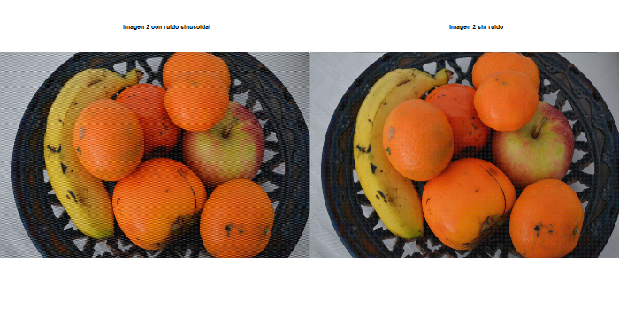
```
Como se puede observar, la eliminación de este ruido con transformadas de Fourier es mejor que con el método de transformadas wavelet y thresholding manual, obteniendo resultados parecidos al de la función `denoise.dwt.2d`.
```{r echo=F, eval = FALSE}
rm(imgr, fft_r, n_r, fshift_r, spectr_r, fft_g, n_g, fshift_g, spectr_g, 
   fft_b, n_b, fshift_b, spectr_b, small, spectr_shifted_r, spectr_shifted_g,
   spectr_shifted_b, fftmod_r, fftmod_g, fftmod_b, img_r, img_g, img_b, img)
```


```{r echo=F,  eval = FALSE}
imgr <- add_noise_to_image("3", "gamma", list(looks = 2))

# CANAL ROJO

fft_r <- fft(imgr[,,1])
n_r <- length(fft_r)

fshift_r <- gsignal::fftshift(fft_r, MARGIN = c(1,2))
spectr_r <- 20*log10(Mod(fshift_r))

# fields::image.plot(spectr1_r)

# CANAL VERDE

fft_g <- fft(imgr[,,2])
n_g <- length(fft_g)

fshift_g <- gsignal::fftshift(fft_g, MARGIN = c(1,2))
spectr_g <- 20*log10(Mod(fshift_g))

# fields::image.plot(spectr_g)

# CANAL AZUL

fft_b <- fft(imgr[,,3])
n_b <- length(fft_b)

fshift_b <- gsignal::fftshift(fft_b, MARGIN = c(1,2))
spectr_b <- 20*log10(Mod(fshift_b))

# fields::image.plot(spectr_b)
```

```{r echo=F,  eval = FALSE}

# CANAL ROJO

small <- 10

fshift_r[0:6000, 0:1200] <- small
fshift_r[0:6000, 2800:4000] <- small
fshift_r[0:2500, 1200:2800] <- small
fshift_r[3500:6000, 1200:2800] <- small

spectr_shifted_r <- 20*log10(Mod(fshift_r))

# fields::image.plot(spectr_shifted_r)

# CANAL VERDE

fshift_g[0:6000, 0:1200] <- small
fshift_g[0:6000, 2800:4000] <- small
fshift_g[0:2500, 1200:2800] <- small
fshift_g[3500:6000, 1200:2800] <- small

spectr_shifted_g <- 20*log10(Mod(fshift_g))

# fields::image.plot(spectr_shifted_g)

# CANAL AZUL

fshift_b[0:6000, 0:1200] <- small
fshift_b[0:6000, 2800:4000] <- small
fshift_b[0:2500, 1200:2800] <- small
fshift_b[3500:6000, 1200:2800] <- small

spectr_shifted_b <- 20*log10(Mod(fshift_b))

# fields::image.plot(spectr_shifted_b)

```

```{r echo=F,  eval = FALSE}
fftmod_r <- gsignal::ifftshift(fshift_r, MARGIN = c(1,2))
img_r <- Re(fft(fftmod_r, inverse = T)) / prod(dim(fftmod_r))
fftmod_g <- gsignal::ifftshift(fshift_g, MARGIN = c(1,2))
img_g <- Re(fft(fftmod_g, inverse = T)) / prod(dim(fftmod_g))
fftmod_b <- gsignal::ifftshift(fshift_b, MARGIN = c(1,2))
img_b <- Re(fft(fftmod_b, inverse = T)) / prod(dim(fftmod_b))

img <- array(0, dim = dim(imgr))
img[,,1] <- img_r
img[,,2] <- img_g
img[,,3] <- img_b

```


```{r echo=F,  eval = FALSE}
par(mfrow = c(2, 2), cex = 0.5)

EBImage::display(Image(imgr, colormode = 'Color'), method='r')
title('Imagen 3 con ruido gamma')
EBImage::display(Image(img, colormode = 'Color'), method='r')
title('Imagen 3 sin ruido')
# plot(Image((imgr), colormode = "Color"))
# plot(Image((img), colormode = "Color"))
```


```{r echo=F,  eval = FALSE}
rm(imgr, fft_r, n_r, fshift_r, spectr_r, fft_g, n_g, fshift_g, spectr_g, 
   fft_b, n_b, fshift_b, spectr_b, small, spectr_shifted_r, spectr_shifted_g,
   spectr_shifted_b, fftmod_r, fftmod_g, fftmod_b, img_r, img_g, img_b, img)
```

# Conclusiones

A lo largo del trabajo se han desarrollado 3 métodos distintos para eliminación de ruido sintético en imágenes, dos basados en transformadas wavelet y uno en transformadas de Fourier. Se han generado diversos tipos de ruido (gaussiano, sinusoidal, gamma...) y se han analizado los resultados variando distintos parámetros.

Comenzamos por el método de transformada wavelet más manual. El primer problema con el que nos encontramos es el tamaño de las imágenes, lo cual solucionamos de dos maneras distintas: redimensionando las imágenes (lo que puede inducir distorsión) o agregando espacio en negro (lo que provocaba problemas de memoria en fotos más grandes o de mayor calidad). Obtenemos que la eliminación de ruido es bastante buena aunque se observa el suavizado de las imágenges, salvo en el caso sinusoidal, donde no se ha conseguido emplear parámetros adecuados para su eliminación.

`denoise.dwt.2d`, función implementada en R, emplea también transformadas wavelet y con este método encontramos resultados mejores. Por un lado, no se tienen problemas de tamaño, sin embargo, vemos que al emplear imagenes de baja resolución, se pierden muchos detalles al eliminar el ruido. Además, uno de los parámetros más influyentes en el resultado es el nivel de descomposición. En general, obtenemos buenos resultados tras la eliminación de ruido, habiendo un buen equilibrio entre el suavizado y el ruido. Finalmente, esta función sí es capaz de eliminar el ruido sinusoidal.

Finalmente, empleamos transformadas de Fourier. Destacamos en este caso que realizando manualmente la disminución de altas frecuencias si se ha conseguido eliminar el ruido sinusoidal sin una gran distorsión a la imagen.

Los tres métodos son capaces de realizar la eliminación de ruido sintético, destacando `denoise.dwt.2d` por su simpleza, facilidad de uso y resultados.

